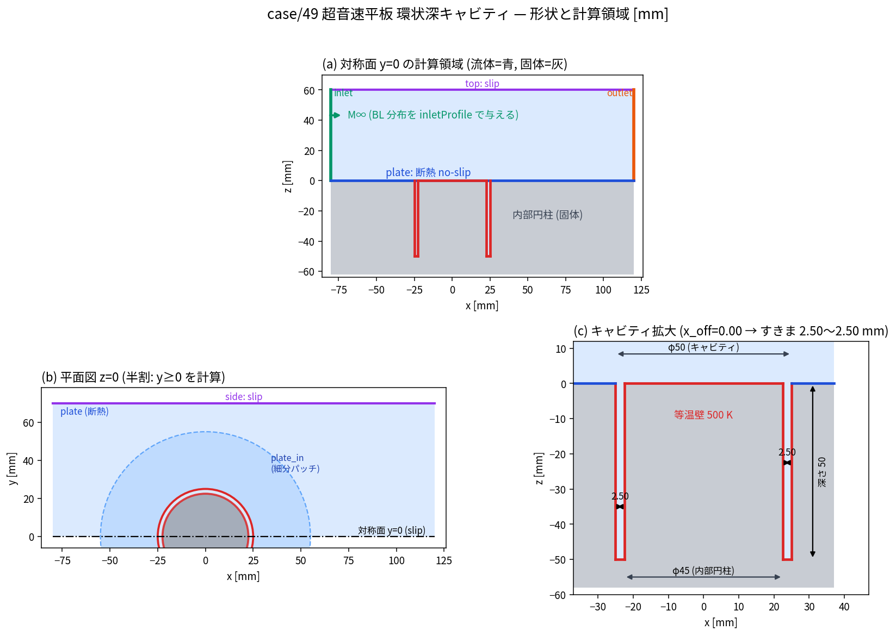

# 49. 超音速平板の環状深キャビティ (等温壁) — 内部温度場

計画: [`plans/active/case-plate-annular-cavity-m5.md`](../../plans/active/case-plate-annular-cavity-m5.md)

超音速流 (既定 M5) が流れる**断熱平板**に開いた円柱キャビティ (既定 φ50 × 深さ 50 mm) の中に、
**φ45 × 深さ 50 mm の円柱が上面面一で埋まっている**。流体側は**幅 2.5 mm・深さ 50 mm の
底閉じ環状スリット**で、キャビティ壁は等温 (既定 500 K)。**その内部温度場**を求めるのが目的。

対称面 $y=0$ の**半割** ($y\ge0$) で解く。形状・条件は下記のパラメータで振れる
(ユーザ要件 2026-09-19: **内部円柱の下流偏心・すきま量・マッハ数が変わりうる**)。



## パラメータ (単一ソース)

| ファイル | 役割 |
| --- | --- |
| **[`case.json`](case.json)** | **最上位入力** (条件 + 形状 + メッシュ + 評価)。マッハ数・すきま・偏心を変えるのはここだけ |
| [`setup.py`](setup.py) `--resolve` | `case.json` → **`manifest.json`** (自由流・BC 値・グループ別面積・VL 層数・physID・CV 定義まで解決) |
| `manifest.json` | **CAD・メッシュ・IC・BC・評価が読む唯一の解決済み設定** (転記事故を防ぐ) |
| [`tools/geom_common.py`](tools/geom_common.py) | 偏心対応の CV マスク・すきま中央線・周方向平均の重み |

```bash
python3 setup.py --resolve                          # case.json -> manifest.json
cd cad && QT_QPA_PLATFORM=offscreen /home/sano/opt/squashfs-root/usr/bin/freecadcmd build_geom.py
python3 tools/plot_geom.py                          # geom_layout.png を再生成
python3 tools/geom_common.py                        # CV マスクの自己検査 (偏心時の取りこぼし)
```

### 既定の作動条件 (`setup.py` 出力, ISA 20 km · M5)

| 量 | 値 | | 量 | 値 |
| --- | --- | --- | --- | --- |
| $T_\infty$ | 216.65 K | | $Re/m$ | 9.1357e6 /m |
| $P_\infty$ | 5474.72 Pa | | $T_t$ (CPG / TP) | 1299.90 / **1222.73** K |
| $\rho_\infty$ | 0.0880483 kg/m³ | | $T_{aw}$ (CPG / TP) | 1187.55 / **1126.33** K |
| $U_\infty$ | 1475.21 m/s | | $T_w/T_{aw}$ (TP) | 0.444 (強冷却) |
| $\mu_\infty$ | 1.42178e-5 Pa·s | | $k_\infty$ / $\omega_\infty$ | 81.6 m²/s² / 5.05e4 1/s |

> **CPG は $T_{aw}$ を +61 K (+5.4 %) 過大に出す** (高温で $c_p$ が +17 % 上がるため)。成果物が温度そのものなので
> **生産 EOS は semi-perfect (TP)** とする (計画 §4.10)。CPG はパイプライン疎通と段階起動レシピ確立にのみ使う。

## 形状と境界 (既定値)

すきま = $R_o-R_i$ = 2.50 mm (偏心 `x_off` を入れると周方向に $2.5\mp|x_{off}|$ mm)。
開口幅/深さ = 0.05 の**極めて深いキャビティ**。

| physID | グループ | 位置 | BC |
| --- | --- | --- | --- |
| 1 | `inlet` | $x=-80$ mm | `inlet_uniformVelocity` + `inletProfile` (2D 前駆の乱流 BL) |
| 2 | `outlet` | $x=+120$ mm | `outlet_statPress` ($P_s=P_\infty$ + 逆流 Pt/Tt) |
| 3 / 4 / 5 | `top` / `side` / `sym` | $z=60$ / $y=70$ / $y=0$ | `slip` |
| 6 / 7 | `plate` / `plate_in` | $z=0$, $r>55$ / $25<r<55$ | `wall` (断熱 no-slip)。`plate_in` は開口周りの細分用 |
| 8 / 9 / 10 | `cav_outer` / `cav_floor` / `cyl_side` | キャビティ 3 壁 | `wall_isothermal` Ts=500 |
| 11 | `cyl_top` | 内円柱上面 | `wall_isothermal` Ts=500 (断熱版も比較) |

**キャビティの検査体積は `cav_outer` + `cav_floor` + `cyl_side` + 開口面**。`cyl_top` は外部流に
面していて CV を囲まないので、熱収支には入れず**別枠で報告**する (計画 §4.8)。

## ワークフロー

```
case.json --setup.py --resolve--> manifest.json
cad/build_geom.py (FreeCAD)  --> cavity_fluid_half.step + geom_used.json
precursor/ (2D 平板 M5 断熱) --> inlet_profile_1.csv (delta≈5mm の z 分布)
cad/mesh_salome.py (SALOME NETGEN + ViscousLayers) --> .med
cad/med_to_msh41.py --> forge.msh --convertGmshToForge--> forge.h5
   -> check_mesh_quality.py + tools/check_mesh_extra.py (体積/sliver/dual)
gen_runs.py --> S0..S6 段階起動 (AWS A10G) --> res_*.h5
tools/cavity_eval.py --> 温度/熱流束/侵入深さ/開口流束 + 時系列 CSV
   -> check_convergence.py (全列) + check_quasisteady.py --series-csv
```

- **計算は AWS g5.xlarge (A10G 23 GB)**。ローカル (RAM 11 GB) は **2.7M 節点の変換で OOM**。
  **全ヘキサは gmsh API だけで作れるので AWS 上で生成できる** (`pip install gmsh` + `libglu1-mesa`)。
  tet+prism の Salome 経路だけはローカル専用 (AWS 未導入)。
- 変換は**最終形の壁タグ**で行う (SST の `wall_dist` のため)。段階起動 S0 の全面 slip は
  実行時に `bcondConfig.yaml` を差し替えて実現する。
- **3D の cross-mesh restart は使わない** — `interp_field.py` は 2 次元最近傍で、深さ 50 mm の
  キャビティでは z が無視される (計画 §3.2)。Stage A / Stage B はそれぞれ S0 から立てる。

## 計算 run 一覧

| `run_*` | 目的・主要設定差分 | 主要結果・成果物 | 状態 |
| --- | --- | --- | --- |
| `precursor/run_0001_precursor_m5` | 2D 前駆 第 1 版 (H=0.05 m)。M5 断熱平板 | 前縁圧縮波が上面 slip で反射し x≳220 mm の外縁判定が破綻 (δ\* が乱れる) | 破棄 (H 不足) |
| `precursor/run_0002_precursor_m5_H100` | **2D 前駆 正本** (H=0.10 m, y₁=6 µm, 段階起動 + cfl 2 × 24000) | x=313.45 mm で **δ₉₉ 5.056 / δ\* 2.899 / θ 0.2243 mm, Re_θ 2085, μt/μ 39 (乱流), T_w 1166.5 K (CPG T_aw 1187.5 の −1.8 %)**。ここから入口 CSV を作成。**準定常 ALL STEADY** (δ₉₉/δ\*/θ/Re_θ/τ_w/T_w の drift ≤0.7 %) | active (**入口分布の供給元**) |
| `run_0001_stageA_cpg` | Stage A (69k 節点) の疎通・段階起動レシピ確立。CPG, 旧バイナリ | 全段 NaN 0 完走 (6.24 ms/step)。`qwall` は全点 0 (診断未実装) | ref (レシピ確立) |
| `run_0002_stageA_qwall` | 同上を **qwall 診断入りバイナリ**で再実行 | **壁熱流束が取得可能に**。断熱 `plate` は厳密 0、等温壁 q'' 平均 8.3–8.5 kW/m²、**壁温 (断熱平板) 最大 1185.4 K = CPG T_aw の −0.18 %**。y⁺ 0.66–0.73 (mean) | active (**Stage A 基準**) |
| `run_0003_stageB_cpg` | **Stage B** (330k 節点, y₁=10 µm, VL 11 層) | 全段 NaN 0 (21 ms/step)。**キャビティ 3 壁 総入熱 74.8 W (全周)**、q'' 平均 4.89 kW/m²・最大 242 kW/m²、**h_ref 93 W/m²K** (基準温度基準)。開口ガス 696 K / 中央 515 K / 底 535 K。侵入 (25 K) 49.5 mm。**報告量は全て STEADY** (drift ≤0.6 %)。y⁺ 0.12–0.13。図 `cavity_fields.png` / `cavity_profile.png` | active (**現行の主結果**) |
| `run_0004_stageC_cpg` | Stage C (589k 節点, y₁=15 µm, VL 7 層, 内面 0.6 mm) | 全段 NaN 0 (27 ms/step)。Q 21.1 W / h_ref 55.1 / 開口ガス 622 K | active |
| `run_0005_stageD_cpg` | Stage D (741k 節点, 内面 0.45 mm, 継ぎ目比 0.239, growth 0.15) | 全段 NaN 0 (39 ms/step)。Q 26.6 W / h_ref 55.2 / 開口ガス 659 K | active |
| `run_0006_hex_cpg` | **全ヘキサ初回** (1.00M 節点) — ローカル。**24.9 ms/step** と tet 版より節点あたり約 2 倍速 | セッション中断で S3 まで。AWS 側の系統列 (run_010x) に引き継ぎ | 破棄 |
| `run_0101_hex_s07` | **全ヘキサ 系統列 粗** (scale 0.7, 340k 節点)。AWS A10G 4.7 ms/step | Q 40.22 W (全周) / **h_ref 56.65 (外筒) 48.33 (円柱側) 31.21 (底)** / すきま中央 ΔT 11.911 K / 開口 ΔT 91.86 K。**開口の正味/片道 質量 −0.73 %・CV 収支 残差 +2.3 %** (tet は 22 %)。評価面 z=−0.5〜−8 mm で残差 ±4 % 以内 | active (**格子収束の正本**) |
| `run_0102_hex_s10` | **同 中** (scale 1.0, 1.00M 節点)。24.9 ms/step | Q 41.29 W (+2.6 %) / **h_ref 56.59 / 47.67 / 31.64 (s0.7 比 ±1.4 %)** / すきま中央 ΔT 11.915 K (**+0.03 %**) / 開口 ΔT 76.62 K (−17 %)。y⁺ 平均 0.043 / 最大 0.73。収支残差 +6.0 % | active |
| `run_0103_hex_s14` | **同 細** (scale 1.4, 2.74M 節点)。89.5 ms/step (GPU 共有時) | 計算中 | active |
| `run_0110_full360_steady` | **全周 360°** (tet 125k, 対称面なし) の定常化。半割仮定の検証用 | 起動全体で残差 **3.3〜8.0 桁低下** (roOmega 8.0 / roK 4.5)。平均 u_θ = −2.475 m/s (= 非鏡像メッシュ由来の床 −1.58 %) | active (**全周ゲートの基準**) |
| `run_0111_full360_urans` | 全周 URANS・旧擾乱 (開口の k を ±1 % sinθ) | **擾乱が弱すぎて指標が 4000 step で 1 桁も動かず判定不能**。測り方の失敗記録 | 破棄予定 |
| `run_0112_full360_swirl` | 全周 URANS・**旋回擾乱 5 %** (dual-time dt 3e-7, nSub 10) | **半割は妥当**: 平均 u_θ が +4.083 → 0.12 ms で符号反転 → 行き過ぎ (−3.65) → 定常値 −2.475 へ復帰 = 反対称モードは**減衰**、成長なし | active (**§4.9 必須ゲート**) |

> **格子収束の状況 (2026-09-19)**: Stage A–D の 4 点は **系統列になっていない** (tet+prism では VL 総厚と
> 接線サイズが結合し独立に振れないため、y₁・層数・面サイズ・成長率を同時に変えてしまった)。
> 最細 2 点 (C↔D) で総入熱が 20.6 % 違う一方、**基準温度基準の熱伝達率 `h_ref` は 0.16 % 一致**しており
> 格子に頑健。収束判定は**全ヘキサの系統列 (run_010x)** でやり直す。

> **ヘキサ系統列の途中結果 (2026-09-19)**: 節点 3 倍 (340k→1.00M) で **h_ref ±1.4 %・すきま中央 ΔT 0.03 %・
> 総入熱 +2.6 %**。動くのは開口直下の点値 ΔT (−17 %) で、勾配が最も急な一点値。3 点目 (2.74M) で
> Richardson 外挿する。
>
> **保存性について**: CV ごとの閉性は tet (5.1e-6) もヘキサ (1.2e-5) も PASS = **どちらも離散スキームとしては
> 保存形**。差が出るのは**後処理の開口面積分**で、閉じたキャビティの正味質量流量 (厳密に 0 のはず) が
> tet 3.3〜7.3 % / ヘキサ 0.73 % であることで測れる。正味エンタルピー流入は大きな 2 項の差なので
> 同じ絶対誤差が一桁増幅され、収支残差 tet 22 % / ヘキサ 2.3 % になる。

> メッシュ本体 (`cad/*.med`, `cad/*.msh`, `mesh/*.h5`) と run 成果物は git に入れない。
> run を作成・破棄したらこの表を必ず同期する (命名 `run_NNNN_<slug>`)。

## メッシュ一覧

| メッシュ | 節点 / 要素 | 品質 | 備考 |
| --- | --- | --- | --- |
| `mesh/stageA.h5` | 69,005 / tet 105,981 + prism 91,399 | AR 184.7 / skew 0.821 **PASS** | VL 7 層・第一層 40 µm。疎通と URANS 用 |
| `mesh/stageB.h5` | 329,868 / tet 367,755 + prism 501,017 | AR 382.0 / skew 0.881 **PASS** | VL 11 層・第一層 10 µm・リップ 0.45 mm。dual 体積 relErr 5.4e-11, 閉性 1.2e-6 |
| `mesh/stageC.h5` | 589,437 / tet 862,563 + prism 814,282 | AR 206.8 / skew 0.874 **PASS** | VL 7 層・第一層 15 µm・内面 0.6 mm |
| `mesh/stageD.h5` | 740,763 / tet 1,514,642 + prism 878,730 | AR **127.6** / skew 0.849 **PASS** (平均 AR 6.1) | VL 6 層・第一層 20 µm・**内面 0.45 mm**・継ぎ目比 0.239・growth 0.15 |
| `mesh/hex_s0.7.h5` | 339,830 / **hex 320,712 (100 %)** | AR 301 / skew **0.500** **PASS** | 全ヘキサ・系統細分列 (scale 0.7) |
| `mesh/hex_s1.4.h5` | 2,739,491 / **hex 2,662,464 (100 %)** | **PASS** (追加ゲートも PASS) | 全ヘキサ・系統細分列 (scale 1.4)。**変換に RSS 9.2 GB** = ローカル 11 GB では OOM |
| `mesh/full.h5` | 125,185 / tet+prism | **PASS** | **全周 360°** (対称面なし)。半割仮定の検証用。鏡像対称ではないので指標に床 1.6e-2 が出る |
| `mesh/hex.h5` (s1.0) | 1,000,428 / **hex 961,200 (100 %)** | AR 302 / skew **0.500** (平均 0.050) **PASS** | すきま横断 24 セル (両壁 20 µm)・深さ 100 (開口 20 µm / 床 80 µm)・周方向 120/半周・平板 BL 55 層 |
| `mesh/hex_s1.4.h5` | 2,739,491 / **hex 2,662,464 (100 %)** | (AWS で生成・変換) | 系統細分列 (scale 1.4)。**ローカルは変換で OOM** |
| `mesh/full.h5` | 125,185 / tet 276,289 + prism 140,210 | **PASS** | **全周 360°** (半割仮定の URANS 検証用) |
| `mesh/plug.h5` | 410,190 / tet 1,125,118 + prism 394,092 | **PASS** | キャビティを塞いだ形状 (流入 BL 移送の検証用) |

**メッシュ生成の要点 (実測 2026-09-19, 4 例)**: **凸角 (開口リップ) まわりの接線セルサイズが VL 総厚を
下回ると、層が自己交差して NETGEN の tet 充填が無言で失敗する** (`Compute: True` なのに tet 0 で
体積の 2.2 % しか埋まらない)。エッジだけに下限を課しても不十分で (リップ 0.9 mm × 面 0.5 mm × VL 0.9 mm で失敗)、
**壁面サイズ全部に下限 = VL 総厚**が要る。`setup.py` がこれを課し、引き上げた面を manifest の
`size_bumped_by_vl` に残す。**帰結**: 内面を細かくするほど VL も薄くせざるを得ず、
継ぎ目比 (最終層厚/壁面サイズ) は (s−1)/s で頭打ちになる。第一層 y₁ は独立なので y⁺ は保てる。

**熱伝達率の基準温度**: `h_ref = q''/(T0_ref − T_w)` の **T0_ref = すきま中央面の最近傍点の総温**
(中央面の底は「すきま幅の半分」で切り取り) を主とする (ユーザ指定 2026-09-19)。深部では回復温度基準の
`h_aw` が見かけ上 0 に落ちるため。総温は `VALUE/h0` から `total_quantities.py` で逆算。

## EOS (CPG / TP)

`case.json` の `conditions.gas` で切替 (`gen_runs.py run --gas TP` でも上書き可)。

- **CPG** — パイプライン疎通と段階起動レシピ確立用。速い。$T_{aw}$ を +61 K 過大に出す。
- **TP (semi-perfect, 生産)** — 乾燥空気を **1 擬似種 MIXDRY** にまとめた NASA-9
  (`species_db.yaml`, `forge_design.gas.semiperfect.mixture_pseudo_species` で生成, R=287.048)。
  `thermalMethod: 2` + `thermoHrefTemp: 298.15`。多成分 TP の implicit 不安定を避けるため 1 種に畳む。
  **IC の内部エネルギーは TP の datum で組み直す** (CPG の $p/(\gamma-1)$ は datum が違う)。
  自由流密度も TP の R で引き直す。

## 偏心スイープ

```bash
python3 sweep_offset.py --offsets 0 0.5 1.0 1.5 --stage D
```

CAD → メッシュ → 変換 → 段階起動 → 評価を各偏心量で通す。VL 層数は最小すきまから自動で引き直される
(例: すきま 2.5/2.0/1.5 mm → 6/6/5 層)。`--dry` で設定だけ確認できる。

## ソルバ側の変更 (本ケースで入れたもの)

- **低 Re 壁の `qwall` / `utau` 診断出力** (`solver_density_cuda/cuda_forge/viscousFlux_d.cu`):
  従来 `wallTreatment==0` では `qwall_b`/`utau_b` に誰も書かず、壁面ダンプの `qwall`/`utau`/`ypls` が
  **全点 0** で熱流束・熱伝達率・$C_f$ が取れなかった。残差に入れたのと同じ解像熱流束を同じ符号規約
  (壁→流体が正) で格納するようにした。モデル経路 (`wallTreatment` 1/2, `sstEnergyWallFunction`) では
  `qwall_b` は入力側なので触らない → **解はビット不変**。検算: 断熱壁で厳密 0、等温壁で負。
