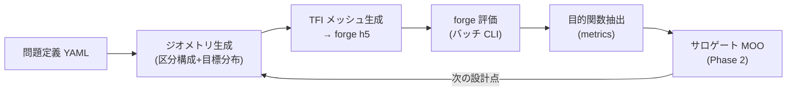

# ノズル設計ツール (design) — 現在仕様

forge を粘性評価器とする超音速ノズル設計ツールの現在仕様。設計判断の経緯・実現性精査は親計画
[`plans/active/tooling-nozzle-design-tool.md`](../../plans/active/tooling-nozzle-design-tool.md)、
技術的背景 (文献・理論) は
[`notes/investigations/nozzle-optimization-tool-survey.md`](../../notes/investigations/nozzle-optimization-tool-survey.md)
を参照。本文書は「ツールが現在どう動くか」のみを記す。

> 状態: Phase 0 (基盤)・Phase 2 (③ベル MOO + Rao 照合合格) 完了 (2026-08-13)。
> 次 = Phase 3 (①風洞: モード F + 帰還エンジン v1–v3 + CONTUR 照合)。本文書は実装と同期して更新する。

## 全体像

対象 5 機種 (① 風洞軸対称 / ② 風洞矩形 / ③ スラスタベル / ④ デュアルベル / ⑤ SERN)。
処理は 5 レイヤ:

壁の決め方は機種で分かれる (親計画 §4.6③/§4.7, 2026-08-13 改訂): **③ベルは TOP 直接幾何 dv**
($\theta_n, \theta_e, L/r_t$ — 下流壁は $P_a$ に C1 接続する TOP 放物線) で直接パラメータ化し、
**①②④⑤は「目標分布による逆設計」** (帰還エンジン — ①で初実装。v1 MOC 逆設計+δ\* 経験式 →
v2 Euler 帰還 [凍結特性線マップ] → v3 NS トレース) で決まる。壁座標そのものを最適化変数に
することはない (例外: ⑤ 3D FFD 段)。

## パッケージ構成

`design/` (リポジトリルート直下、Python パッケージ `forge_design`):

| モジュール | 責務 |
| --- | --- |
| `probdef` | 問題定義 YAML の読込・検証 (spec/derived/dv 3 区分、過拘束チェック) |
| `geometry` | 区分構成壁 (収縮 Bell–Mehta 5 次 / スロート円弧 $R_u,R_d,\theta_a$ / 下流壁)、中心線マッハ Bézier、Kliegel–Levine 遷音速級数 + kernel MOC (アンカー)、事前フィルタ |
| `meshing` | 構造化 TFI メッシュ生成 (トポロジ固定) → forge HDF5 直書き、品質ゲート |
| `evaluate` | バッチ評価 CLI: run ディレクトリ準備 → forge 起動 → 収束/NaN 自動判定 |
| `metrics` | `res_*.h5` からの目的関数抽出 (固定サンプリング格子補間) |
| `feedback` | 帰還エンジン (**v1/v2 実装済み** — 親計画 §4.7): `deltastar` (δ* 経験式 = Eckert 参照温度 + 乱流平板相関) / `euler_loop` (v2: 凍結 C⁻ マップ + PM 換算 + trust-region ω + 同一トポロジ再メッシュ + warm restart。case/41 で 0.45% Md 収束実証)。`geometry/moc_inverse` (逆 MOC 三角充填 + 壁流線抽出) と `geometry/wall_modef` (モード F 複合壁)、`evaluate/runner_wt` (①評価: Euler cell/slip) が対 |
| `opt` | サロゲート MOO ループ (**実装済み**): `ehvi` (2目的 EHVI 閉形式・MC照合済) / `doe` (LHS) / `surrogate` (SMT KRG) / `moo` (NSGA-II+EHVI infill) / `driver` (バッチ評価: 2段起動・VERDICT/物理ゲート・warm seed) / `polish` (チャンク継続+ηドリフトゲート)。実行は `design/.venv-opt` |
| `menu` | 特殊解析メニュー (凝縮・高度スイープ — Phase 3〜) |

## 問題定義 YAML

1 案件 = 1 YAML。全パラメータは 3 区分で宣言する:

- `spec`: 案件仕様 (入口全圧/全温/組成、試験部径・設計マッハ、要求推力・背圧 等)
- `derived`: spec から決まる量。スロート径 $r^*$ は「閉ループ派生」(風洞: 無次元設計→出口径
  スケーリング、スラスタ: $C_d$ 実測補正) で、最適化の探索次元に入らない
- `dv`: 設計変数 (機種別の既定セットは親計画 §4.6)。どれでも固定値化できる

読込時検証: ($D_e$, $r^*$, $M_d$) の独立指定は 2 つまで (過拘束はエラー)、dv の bound、
Bézier 自由度勘定の整合。

## ジオメトリ (区分構成)

壁は上流から: 入口配管 → 収縮 (Bell–Mehta 5 次) → 曲率ブレンド → 上流円弧 $R_u$ →
スロート → 下流円弧 $R_d$ (終端角 $\theta_a$) → 下流壁 → 出口。

- 下流壁は `geometry.bell_type` で選ぶ: **`top` = TOP 放物線** ($P_a$ で接線 $\theta_n$・出口
  $(L,\sqrt{\varepsilon})$ で接線 $\theta_e$ の 2 次 Bézier。③の既定で、$\theta_n,\theta_e,L$ が
  そのまま dv。整合条件 $\tan\theta_n >$ 弦勾配 $> \tan\theta_e$ は構築時に検査) /
  **`hermite` = 3 次 Hermite** (同じ端点条件の旧初期壁・回帰対照。①②では逆設計の出発点で、
  精度は帰還の収束速度にのみ影響)。`theta_e_deg` は dv 宣言があれば dv、なければ geometry 固定値。
- 中心線マッハ Bézier: CP の x 等間隔固定で $M_c(x)$ は次数 $n$ の多項式。両端 C2 拘束で
  自由 CP 数 $k=n-5$ (`geometry/bezier.py`)。
- アンカー (始点 $x_k$ での $M,M',M''$): Sauer 遷音速解 (`geometry/transonic.py` — 幾何スロートと
  軸ソニック点のオフセット込み) の starting line から **kernel MOC** (`geometry/moc_kernel.py`:
  楔充填 + 規定壁ステーションの C⁻ フロントマーチ、放射源流厳密解 0.1%・平面単純波則 1%・
  格子収束 <0.5% で検証済み) が設計変数のみの決定的関数として与える。
  **既知の制約**: $R_d \lesssim 1$ は Sauer パッチが円弧終端を超えるため明示エラー
  (Kliegel–Levine 高次の実装が今後の課題)。
- **CFD アンカー (①モード F の逆設計)**: Sauer 一次解は実 CFD と $M'$ +25% / $M''$ 2.3 倍
  ずれることが実測され ([plan §9.2 B5](../../plans/active/tooling-nozzle-phase3-windtunnel.md))、
  接合波の主因は設計 Cauchy データと実流の不整合だった。`geometry.throat_anchor_run` に
  既存 run を指定すると、`feedback/cfd_anchor.py` の `CFDThroat` がその CFD 場から
  軸 $M(x)$ の局所多項式フィットと starting line の $M(r),\theta(r)$ (偶/奇多項式
  最小二乗) を抽出し、SauerThroat 互換 (`starting_line`/`mach`) で `design_chain` /
  `inverse_design` に供給する。$x_0$ は「CFD 軸 $M=M_{start}$」で決め ($M_{start}$ は
  `geometry.M_start`、既定 1.05 — 数値上の選択であり物理定数ではない)、アンカーは
  抽出元 run に**凍結** (遷音速場は下流壁にほぼ依存しない — 実測 ΔM 0.0024 — ため
  1 回の抽出で足りる)。**残課題 (ユーザ指示 2026-08-15)**: ブートストラップ元の
  初期壁品質と CFD 不要のプレビュー経路のため、初期遷音速解の二次化
  (Kliegel–Levine) は別途実装する。
- **目標曲線の起点 = $x_{\mathrm{reach,CFD}}$ (B10, plan §9.2 — 2026-08-17 以降の正本)**:
  設計 target と自由設計変数の起点を、$x_0$ (=$M_{start}$ の縦 starting line) では
  なく **$x_{\mathrm{reach,CFD}}$** にする。これは「自由壁が軸へ影響できる最初の位置」
  = **固定円弧終端 $J=(x_j,r_j)$ から出る CFD C⁻ 特性線の軸着地点**であり、
  実 CFD 場の $\theta$ と $\mu=\arcsin(1/M)$ から積分して求める (逆 MOC 場からは
  求めない)。$J$ と $x_{\mathrm{reach}}$ は別の $x$ 座標であることに注意。
  target は $[x_{\mathrm{reach,CFD}}, x_d]$ に**のみ**定義し、始端で CFD の
  $M,M',M''$ を継承 (C2)、終端で $(M_d,0,0)$。自由 CP 3 個は両拘束下で現行下流
  target との差を最小化する拘束付き最小二乗で決定的に射影する。
  $x<x_{\mathrm{reach,CFD}}$ には target を置かず帰還・収束判定から除外し、
  上流の軸 M・こぶ・圧力勾配は**別の物理診断**として記録する
  (旧 B7 の「実測こぶ曲線を上流評価 target へコピー」する帳簿処理は廃止)。
  $x_{\mathrm{reach,CFD}}$ は正式ゲートを通した cold 基準 run から一度取得し、
  帰還ループ中は固定する。
- **[旧] 目標曲線の $x_{\mathrm{reach}}$ 分割 (B7, plan §9.2)**: 設計壁始点 $x_0$ から
  $x_{\mathrm{reach}}$ (=設計壁の**最初に成功する** C⁻ が軸へ着地する位置。凍結
  v1 MOC マップ `build_cminus_map` の被覆下限として一意に決まる、taper 幅とは無関係の
  幾何量) までは、壁側の帰還がそもそも届かない区間である。ここへ**自由 CP が生成する
  グローバル Bézier の値**を目標として課すと、Bézier の大域台 (Bernstein 基底は局所
  支持を持たない) を通じて遠方 CP の形が押し戻り、到達不能な区間に「直しようのない
  ズレ」を最初から作り込む (実測: run_0018 の主残差 $x/r_t\approx1.38$ で
  $\Delta M\approx+0.05$、CP2 の基底重みが既にその位置で 11%)。そこで
  `design_chain` は 2 段構成にする: **① ブートストラップ**（$x_0$ アンカーだけの
  旧来の単一 Bézier で仮設計 → MOC マップ被覆から $x_{\mathrm{reach}}$ を得る)、
  **② 本設計**（$x_0\le x<x_{\mathrm{reach}}$ は $x_0$ と $x_{\mathrm{reach}}$
  両端の局所アンカー $(M,M',M'')$ だけで決まる**5 次 Hermite** (free_cp なしの
  `MachBezier.from_constraints`) を通し、$x\ge x_{\mathrm{reach}}$ だけを自由 CP
  の Bézier に担当させ、$x_{\mathrm{reach}}$ で $M,M',M''$ を接続する)。
  **区間全体を 1 本の曲線として直接フィットする方式は不採用** (実測 2026-08-15):
  この近スロート域は cell モードに軸上 DOF が無く軸方向のセル列が疎 (幅 1.4 $r_t$
  に ~30 列) で、高次多項式は Runge 振動・bin 平均は列疎密混入で非単調・等調回帰は
  勾配ごと潰す、と軒並み破綻した。$x_{\mathrm{reach}}$ でのアンカーは `CFDThroat`
  の `local_anchor()` ($x_0$ の点アンカーと同じ狭窓ローカルフィットを任意点に一般化。
  ただしセル疎な場所向けに既定を低次・広窓化: degree=2, halfwidth=0.4)、Sauer 時は
  `SauerThroat.mach()` (解析式、全域で有効) を使う。
- 事前フィルタ: CP 単調性、$dM_c/dx$ 凝縮上限 (足切りのみ)、壁 `validate()` (単調性・スロート最小)。

## wall-driven チェーン (①風洞・実装中 — 現行モード F と並存)

計画: [`plans/active/tooling-nozzle-walldriven-chain.md`](../../plans/active/tooling-nozzle-walldriven-chain.md)。
モード F (目標軸マッハ → 逆 MOC) と異なり、**壁を先に設計し $M_c(x)$ は診断量**とする:
U→T→D 低自由度多項式壁 → CFD (遷音速+初期超音速を実場で解く) → D からの C⁻ 特性線上の
データ抽出 → D 下流を wave-cancellation MOC で従属生成 → δ\* 補正 → 全域 B-spline。
凍結円弧とその接合 J が存在しないのが本質 (スロート曲率は条件 $r''(0)=1/R_t$ として残る)。

実装済み (Phase W1–W2): `geometry/wall_walldriven.py`。無次元 ($r_t=1$、スロート $x=0$)。

- **U→T** (`UpstreamThroatPoly`): 両端 6 条件の quintic Hermite。
  U 側 $(r_U,\,0,\,0)$ → T 側 $(1,\,0,\,1/R_t)$。単調収縮 ⇔
  $\mu=L_U^2/(R_t\,\Delta r)\le20$、すなわち $L_U\le\sqrt{20R_t\Delta r}$
  ($\Delta r=r_U-1$。勾配閉形式 $\frac{dr}{dx}=\frac{\Delta r}{2L_U}\xi^2(\xi-1)[5\mu\xi-3\mu-60\xi+60]$
  から導出、数値検証済み・必要十分)。
- **T→D** (`ThroatExpansionPoly`): 壁勾配 $q=r'$ を cubic Hermite で規定
  ($q(0)=0$, $q'(0)=1/R_t$, $q(L_D)=\tan\theta_D$, $q'(L_D)=0$) した 4 次壁:
  $$q(\xi)=\frac{L_D}{R_t}\xi(1-\xi)^2+\tan\theta_D\,\xi^2(3-2\xi),\qquad \xi=x/L_D$$
  D 半径は入力でなく従属: $r_D=1+\frac{L_D^2}{12R_t}+\frac{L_D}{2}\tan\theta_D$。
  途中変曲なし (全区間 $r''\ge0$) ⇔ $L_D\le3R_t\tan\theta_D$ (必要十分)。
- **合成** (`WallDrivenThroatRegion`): $r,r',r'',r'''$ 解析式 → $\theta,\kappa,d\kappa/ds$ も
  解析評価。T で κ は $1/R_t$ に連続、**κ' は一般に不連続** — 跳び量は診断値
  `kappa_prime_jump_at_throat` として常時出力 (許容可否は CFD で判定する)。
  `validate()` は解析条件と密サンプル検査 (単調性・変曲・$r>0$) の二重返しで、
  `dkds_max` を与えると $\max|d\kappa/ds|$ の上限も課せる (数値既定値は W3/W5 で決定)。
- **エラー 2 層方針**: 不正入力 (非有限・非正の長さ/半径・$\theta\notin(0,\pi/2)$・
  出口半径非正) は**構築時に `ValueError`** (係数生成前に遮断)。`validate()` は
  「幾何は定義できるが設計条件違反」のみを返す。全クラス共通。
- **geometry option** (`contraction_to_cone_quintic`): 直管→一定傾斜 $-\tan\theta_a$ への
  quintic 接続。曲率符号一定 ⇔ $\lambda=L\tan\theta_a/\Delta r\in[5/3,\,5/2]$、
  $\lambda=2$ で 4 次に退化。①主経路では未使用の保存知見。

テスト: `design/tests/run_walldriven_tests.py` (端点条件 1e-12・境界 ±0.1% 判別・違反ケース
検出・解析 κ/dκds と数値微分の一致・CFD 壁の C2 接続・不正入力拒否)。

**W3 (メッシュ/CFD 接続, 実装済み)**: `WallDrivenCFDWall` = 直管 + U→T→D +
θ_D 円錐 (D 発 C⁻ = W4 データ線を軸着地まで収める延長)。任意で戻しテーパ+円筒も
持てるが**既定は円錐のまま outlet で打ち切り** (`L_turn=L_cyl=0`)。評価は
`evaluate/runner_walldriven.py` (problem type `wind_tunnel_axisym_walldriven`、
node Euler、**段階起動必須** — soft 1次+cfl0.5 3000 step → 本段。cold 単段
conv1+cfl4 は D 発膨張波の軸反射が壁へ戻る帯で準 1D IC の過渡が破綻し初手発散)。
dv は `theta_D` / `R_t` / `L_D_frac` (L_D = frac × 3R_t tanθ_D)。

**訂正 (2026-08-15)**: 当初 cold 単段の発散を node の既知問題 (傾斜壁∩超音速
流出コーナー、`plans/active/boundary-node-nozzle-wall-outlet-stability.md`) と
誤診断し戻しテーパ+円筒を導入したが (`run_0042_walldriven_w3c`)、円錐のみ+
段階起動の切り分け (`run_0043_conecheck_staged`) で NaN なし完走・うねり指標も
同水準 (+0.00088 vs +0.0009) と判明 — **真因は cold 単段の CFL** で、既知問題
とは無関係。テーパ機能はコードに残すが生産既定は円錐のみ。

疎通実測: 軸うねり +0.0009 (円弧 R=5 の 1/11 — 接合こぶ実質消滅)、データ線
P0 変動 0.196% (WARN 帯、非回転 MOC 可)。

**W4 (特性抽出 + 壁生成、暫定近似が動作・軸対称厳密化は未完了)**:
`geometry/moc_cancel.py`。**検証済み**: `extract_dataline_cfd` (D 発 C⁻ +
$P_0$ 診断。線形補間で実測 WARN 0.18%)、`build_field` (内点充填。放射源流
厳密解と個々の点が <0.1% 一致、格子収束確認済み)、`_wall_cancel`/
`march_wall_from_dataline` (壁で $J^-_W=\nu(M_{\rm target})$ を課す方式。
退化チェック機械精度・流線自己整合性 ~1e-8・格子収束 <0.5%)。

**モデルとしての限界 (2026-08-15、外部レビューで確認)**: $J^-_W=\nu(M_{\rm
target})$ を全壁点で一定と置く現行の閉じ方は、**軸対称からの真の逆 MOC では
ない**。真に出口から逆走するなら局所 $M,\theta$ を更新しながら特性線を逐次
追跡する必要があり、かつ軸対称では $J^-$ が源項 $S^-(M,\theta,r)$ を持つため
保存量でない ($J^-_W=\nu(M_{\rm target})-\int_W^e S^-\,ds$ が必要、積分内
未知で単純代入では閉じない)。現行は積分をゼロと置く**平面流近似**である。
終端条件も壁点自身の状態のみを見ており、出口断面全体の一様性は未検証。
実 CFD (D の $M\approx2.26$ vs $M_d=4$、大きな $J^-$ ギャップ) では march が
発散するケースもある。**厳密化の 2 経路 (未実装)**: (a) 出口終端特性線から
源項込み backward MOC + $D$ 側 forward MOC との matching (自由境界問題)、
(b) 仮の壁で実 CFD を解き出口非一様性を目的関数に壁/$\theta_D$ を反復調整
(W5 outer loop と統合)。詳細は `moc_cancel.py` docstring と plan §4 参照。
Phase W5 以降は上記厳密化を経てから着手する。

## axis-Mach チェーン (①風洞・実装済み — 2026-08-15 起票・同日 A0–A5 完了の主線)

計画: [`plans/accepted/tooling-nozzle-axismach-chain.md`](../../plans/accepted/tooling-nozzle-axismach-chain.md)
(A0–A5) + [`plans/accepted/tooling-nozzle-axismach-throat-characteristic.md`](../../plans/accepted/tooling-nozzle-axismach-throat-characteristic.md)
(A8: 初期値線のスロート特性線化)。
軸中心 Mach 分布 $M_{\rm axis}(x)$ を**低自由度の一次設計変数**とする Sivells 型逆設計:

$$\text{Hall 遷音速解} \rightarrow M_{\rm axis}\ (\text{5次 Hermite},\ \text{自由度 } L_c) \rightarrow \text{逆 MOC} \rightarrow \text{Euler CFD} \rightarrow \text{characteristic 追跡でアンカー更新}$$

モード F の Bézier 軸分布 (自由 CP 3 個 — B10-c で「始端 C² と出口 C² を同時に満たせない」と
確定) を、**両端 6 条件をちょうど消費する 5 次 Hermite に差し替え**、残る自由度を加速区間長
$L_c$ の 1 個に集約する。wall-driven チェーン (W5 以降保留) とはスロート上流の壁表現
(`UpstreamThroatPoly`) を共有する。

### 点の定義 (A / E / F)

| 記号 | 定義 |
| --- | --- |
| $x_A$ | 軸 Mach 指定開始点 = **初期値線の軸着地点**。既定 (`start_line: throat_char`) はスロート特性線の軸着地。旧構成 (`vertical`) では $M_{\rm start}\approx1.05$ 縦線の軸位置で、CFD 反復時は $x_{\rm reach,CFD}$ (壁始点発 C⁻ の軸着地点) に更新した |
| $x_E$ | 軸上で初めて $M=M_d$ に到達する点。$M'(x_E)=M''(x_E)=0$。$L_c = x_E - x_A$ |
| $x_F$ | 物理出口 (断面全体が $M_d$, $\theta=0$)。$x_E \ne x_F$。第一近似 $x_F - x_E \approx r_F\sqrt{M_d^2-1}$, $r_F = r_t\sqrt{A_e/A_t}$ |

逆 MOC の target 軸配列は $x>x_E$ を $M=M_d$ 一定で $x_F$ 予測値+マージンまで延長する
(`x_end_margin`、既定 2.3 — これは**場の計算範囲**であって長さの決定要因ではない)。

**物理出口 $x_F$ は終端特性線で決める** (`moc_inverse.terminal_exit`, `exit_mode:
characteristic` が既定。2026-08-15 ユーザ指摘で置換): $E=(x_E,0)$ から出る C⁺
($dr/dx=\tan(\theta+\mu)$) を MOC 場の中で追跡し、**壁流線との交点**を $F$ とする。
この特性線は一様域の上流境界なので、$F$ 以降の断面は $(M_d,\theta=0)$ で埋まる。

**旧方式 (壁角しきい値) の何が問題だったか**: 壁流線の $\theta$ が 0.05° を切った点で
切っていたが、壁角は $F$ へ**漸近的に**ゼロへ近づくため、しきい値は $F$ の
**2.59 $r_t$ 上流**で発火していた ($M_d$=4, R=2 実測。半径差は 0.0005 $r_t$ = ほぼ円筒部)。
結果として**一様コアが出口面に届かず** (コア半径が出口半径の 80%)、使える試験流が
狭まっていた。特性線方式に変えると着地点で $\theta_w=1\times10^{-10}$ 度・
$M_w=4.0000000$ となり (設計の自己整合の検算になる)、**コアが出口全面を満たす**
(run_0048: コア面 65/65)。直線 Mach line 近似 $x_F=x_E+r_F\sqrt{M_d^2-1}$ とは 0.04% 一致。
$x_F$ は `x_end_margin` を 2.3→3.0 と変えても 0.08% しか動かない (長さは MOC が決めている)
が、margin が不足すると場が $F$ に届かず追跡が失敗するため**明示エラー**にする
(旧方式はここで黙って「計算した壁の終端」を返していた)。

#### 全長を設計変数にする (`Lc_mode: from_length`, dv `L_total` — 2026-08-31)

計画: [tooling-nozzle-axismach-length-dv.md](../../plans/accepted/tooling-nozzle-axismach-length-dv.md)。
従来は加速区間長 $L_c$ (軸 M が極大 $M_d$ に達する $x_E$ までの長さ) を直接 dv に
していたが、設備・機体に効くのは**スロート→物理出口の全長** $x_F$ の方で、
$x_F-x_E$ (終端特性線の一様化区間) は $\approx r_F\sqrt{M_d^2-1}$ で $L_c$ に
ほぼ依存しない物理量である。`Lc_mode: from_length` は dv を
**`L_total`** ($=x_F$。スロート $x=0$ 起点・$r_t$ 単位) とし、$x_E$ (= $L_c$) を
**終端特性線込みの設計パスから逆算する**:
解析初期推定 $L_c^{(0)}=L_{\rm total}-x_A-r_F\sqrt{M_d^2-1}$ → ステップ $=-$残差の
固定点反復 (写像 $x_F(L_c)$ は傾き $\approx1$ の単調なので縮小率 ~0.05)。
離散 MOC の $x_F$ には解像度依存の**ノイズ床** (n_axis 500 で ~0.05 $r_t$ の階段) が
あり secant の局所勾配推定は壊れるため使わない。収束判定は `L_total_tol` (既定 0.05
$r_t$ = n500 ノイズ床相当。詰めるなら `n_axis_inv` を上げて tol を下げる)。
窓外の `L_total` は到達可能な $x_F$ を添えて**明示エラー**。全 `axis_law`
(quintic / knot / …) に共通で、knot の第 2 dv $M_K$ は独立のまま。実測では初期推定が
既に tol 内 (M4/R2, $L_{\rm total}$=20 で残差 0.036・設計パス 1 回; M6/R3 knot
$L_{\rm total}$=100 で 2 回)。診断は返り値 / `prepare_info.json` の `Lc_solve`
(`L_total_target` / `xF_residual` / `n_design_evals`)。従来の `explicit`/`max` は
回帰対照として不変。テスト: `design/tests/run_axismach_length_tests.py`
(往復一致 = 逆算した $L_c$ を `explicit` に渡すと bit 同一の $x_F$)。

### 逆 MOC の初期値線: スロート特性線 (`geometry/transonic.py::throat_characteristic`)

計画: [`plans/accepted/tooling-nozzle-axismach-throat-characteristic.md`](../../plans/accepted/tooling-nozzle-axismach-throat-characteristic.md) (A8)。

曲率のあるスロートでは幾何スロートの壁は既に超音速 (Hall, $R=2$, $\gamma=1.4$ で
$M_w=1.129$) なので、そこから右進特性線 $dr/dx=\tan(\theta-\mu)$ を Hall 場の中で
軸まで下ろせる。この **C⁻ が超音速 MOC の初期値線** (CONTUR の throat characteristic) で、
その軸着地点が $x_A$ = 「壁の設計が軸に影響を及ぼせる最初の位置」になる。
$r$ 等間隔に $n_{\rm start}$ 点へリサンプルして与える (`start_line: throat_char`、既定)。

**旧・縦 starting line ($M_{\rm start}=1.05$) の何が問題だったか** (2026-08-15 実測、$R=2$/$M_d$=4):

| | 縦線 | スロート特性線 |
| --- | --- | --- |
| 軸着地 $x_A$ | 0.2477 | 0.5369 |
| 壁足 | $(0.2477,\ 1.0153)$、$\theta$ は Sauer 線形化の過小評価を手当てして上書き | $(0,\ 1)$ 厳密・$\theta=0$ 厳密 |
| 壁流線の始点 | $x_A>0$ → $[T, x_A]$ を骨接放物線で埋める必要がある | スロートそのもの (**T 以降の壁は全域が MOC 出力**) |
| **到達不能帯** $x_{\rm reach,CFD}-x_A$ | **1.533** $r_t$ | **0.0019** $r_t$ |

縦線は特性線でないため、その壁足から実際に下ろした C⁻ は軸のはるか下流に着地する。
つまり $[x_A,\ x_{\rm reach}]$ の軸目標は**壁の自由度では原理的に到達できない帯**で、
設計が指定しても実現されない (B6/B7 の「到達不能域」の正体)。特性線構成ではこの帯が
構造的に消える (CFD 実測で 0.002 $r_t$ = ほぼ厳密一致)。副次的に (i) 単位過程の担体割当てが
線上で反転しないのでスロート直後の未計算楔が消え、(ii) 骨接放物線区間が不要になり、
(iii) 特性線着地点の $M''_A$ が小さい (0.032 vs 0.113) 分だけ $L_c$ の単調ゲート上限が
緩んで**同じ単一 quintic でより長いノズル**が引ける ($x_E$ 9.63 → 10.25)。

**A/B 実測** (case/41 run_0049 [縦線] vs run_0050 [特性線]、Hall アンカー pass0・
$n_{\rm axis}$=2000・終端特性線出口・差分は `start_line` と `ni` のみ):

| 指標 | 縦線 | スロート特性線 |
| --- | --- | --- |
| $\|\Delta M\|_\infty$ [% $M_d$] | 0.433 | **0.353** |
| $\Delta M$ rms | 0.0096 | **0.0082** |
| 軸うねり amp (deg3, 窓 0.55–2.5) | 0.00147 | **0.00043** |
| 出口 $\varepsilon_M$ rms | 0.041% | **0.020%** |
| 出口 $\|\varepsilon_\theta\|_{\max}$ | 0.0112° | **0.0062°** |
| 到達不能帯 | 1.533 $r_t$ | **0.0019** $r_t$ |

**アンカー更新なしの 1 パスで 0.5% $M_d$ ゲートを通る** (旧構成は 3 パス required で
0.451%)。CFD アンカー更新 (下記) は引き続き使えるが、必須ではなくなった。

### 軸 Mach law: 5次 Hermite (`geometry/axis_law.py`)

$s=(x-x_A)/L_c\in[0,1]$、$M(s)=\sum a_i s^i$。両端 6 条件
($M_A,M'_A,M''_A$ / $M_d,0,0$) の閉形式:

$$a_0=M_A,\quad a_1=L_cM'_A,\quad a_2=\tfrac12 L_c^2M''_A,\quad \Delta M=M_d-M_A$$
$$a_3=10\Delta M-6a_1-3a_2,\quad a_4=-15\Delta M+8a_1+3a_2,\quad a_5=6\Delta M-3a_1-a_2$$

**設計ゲート**: $M'\ge0$ 全域 (hard — これで $M\le M_d$、overshoot 0 が自動保証) /
$M''$ 符号反転回数 $\le1$ (品質指標)。許容 $L_c$ は `admissible_Lc_range` (窓探索) で返す。

**実装で確定した構造 (2026-08-15)**: 単調ゲートは $L_c$ の**上限側**を縛る。
$L_c\to0$ では law が smoothstep に退化し常に単調 (下限は壁角/曲率 QA が課す) だが、
$a_2=\frac12L_c^2M''_A$ が $L_c^2$ で成長するため $M''_A>0$ では長い $L_c$ が単調性を
破る。Hall アンカー (R=2) の窓上限は 9.57 → 単一 quintic では $x_E\approx9.6$
(B8 の 14 より短い)。より長いノズルは区分 $C^2$ spline (A6, 下記 knot 則) を使う。

#### knot 付き区分 $C^2$ 則 (`KnotQuinticAxisLaw`, A6 — `geometry.axis_law: knot`)

計画: [tooling-nozzle-axismach-knot-law.md](../../plans/accepted/tooling-nozzle-axismach-knot-law.md)。
**高マッハで単一 quintic が成立しない理由 (M6, 2026-08-16 実測)**: 終端特性線 E→F は一様域の
上流境界なので $\mu_d$ の直線で $x_F-x_E=r_F/	an\mu_d$ (M6 で 55 $r_t$、M4.2 で 16)。
単一 quintic の $L_c$ 上限 (M6/R3 で 17.9) では壁の膨張区間がスロート 2 $r_t$ 以内に押し込められ、
$	heta_{\max}=27.7° > \mu_w=24.7°$ となる。逆 MOC は軸から C⁻ を後退させて壁へ届かせる構成
なので $	heta_w\ge\mu_w$ で後退線が折り返し**極限線 (fold)** を作り (C⁺ 線上に点が堆積・多価)、
閉包壁に Δθ 12° の折れが出て壁 QA が落ちる (解像度に依らない)。必要なのは長い $L_c$ であり、
スロート勾配 $M'_A$ を保ったまま伸ばすには序盤の急膨張と後段の緩い膨張を分ける自由度 = knot。

構成: 区分 1 $[x_A,x_K]$ は 5 次 Hermite (Hall アンカー → $(M_K, s_K, 0)$)、区分 2 $[x_K,x_E]$ は
4 次 $M=M_K+\Delta M_2(2u-2u^3+u^4)$ ($M'=2\Delta M_2(1-u)^2(1+2u)/L_2\ge0$、
$M''=-12\Delta M_2u(1-u)/L_2^2\le0$: 構成的に単調・凹、終端 $M'=M''=0$)。knot 勾配
$s_K=2\Delta M_2/L_2$、$L_1=2\Delta M_1/(M'_A+s_K)$ (台形則、1 次元 bisection)。
DOF は $(L_c, M_K)$ で **$L_c$ に上限なし**。ゲートは quintic と同じ。
M6/R3 では $L_c$ 25 でまだ fold (Δθ 3.9°)、35 で θ_max 17.5° < μ_w 19° (Δθ 0.9°)、45 で 14° (M4.2 並)。
**全長は $L_c+55\,r_t$ 以上** (出口 1 m で ≥ 5 m) が M6 の物理的必然。

**$M_K$ 感度 (2026-08-17, M6/R3)**: $L_c\in\{30,35,40,45,50,60\}$、
$M_K=1.5$〜4.0 (0.1 刻み) を n_axis 600 で全 156 点、代表点を 1200/2400 で再評価した。
成立候補は全て $M''$ 反転 1 の単峰で、内部 flip / 非隣接交差 0。最小壁角は $L_c=40/60$ では
既定 $M_K=2.5$、$L_c=45$ では $M_K=2.6$ ($\theta_{max}$ 14.108→14.045°、
$\min(\mu-\theta)$ 1.777→1.841°)、$L_c=50$ では $M_K=2.7$ (12.953→12.739°、
2.407→2.534°)。後2点の knot 位置はともに $(x_K-x_A)/L_c\approx0.089$。ただし最小 sin 角は
$L_c=45$ で 0.0412→0.0388、50 で 0.0509→0.0444 と少し低下する。したがって既定2.5は広い長さで
良好かつ鈍感、設計上の微調整候補は 45/2.6 と 50/2.7。CFD未実施なので生産既定は2.5を維持する。
成果物: `case/42.isobutane_wt/sweep_axislaw_A_MK.{json,png}` / `_summary.csv`。

**最短ロバスト設計の評価順序**: 軸則 A の長さを詰める場合、「各 $L_c$ で
$\theta_{max}$ が小さい」ことを全体最適の意味での「最良」とはしない。まず軸則・壁 QA と
characteristic topology の hard gate、単峰条件、$\min(\mu-\theta)\ge1^\circ$、
$\min|\sin\angle(C^+,C^-)|\ge0.02$ を制約として課し、合格集合の中で閉包後端 $x_F$ を第一目的に
最小化する。同じ $x_F$ の候補間だけ $\theta_{max}$、曲率、余裕量で順位付けする。M6/R3 では
$x_F-x_E$ が終端 Mach と半径でほぼ固定なので、この探索では $x_F$ と $L_c$ の最小化は実質同値。
$1^\circ$ と 0.02 は数学的成立限界ではなく離散化・設計摂動に対する工学的余裕であり、別の余裕を
採る場合は「数学的最短」「ロバスト最短」を区別して報告する。

解像度は全候補を `n_axis=600` で探索し、最短境界の候補だけ `n_axis=1200` で再評価する。
`n_axis=2400` は、1200 点で閾値近傍・順位不安定・トポロジ極小が未収束の場合に限る。600 点では
$\theta_{max}$ と $\min(\mu-\theta)$ の順位は安定した一方、最小 sin 角は楽観側に出るため、
最終採否を600点だけでは確定しない。

**M6/R3 最短結果 (2026-08-17)**: `L_c` を35–40、`M_K` を同時に粗→細→0.01刻みで600点探索した。
600点では $(L_c,M_K)=(39.03,2.76)$ が $\min(\mu-\theta)=1.0003^\circ$ で最短だったが、
1200点では39.03/39.04が0.9975/0.9992°となり不合格。最短合格は
**$(39.05,2.76)$** で、$x_F=94.34865\,r_t$、$\theta_{max}=16.1281^\circ$、
$\min(\mu-\theta)=1.00095^\circ$、最小sin角0.04177、内部flip/交差0。$r_t=53.75$ mmでは
軸Mach指定長 $L_c=2.099$ m、閉包後端はスロート基準で5.071 m。これは0.01格子と1°工学余裕に
対する**設計上の最短境界**であり、生産既定変更にはCFD確認を別途要する。成果物:
`case/42.isobutane_wt/optimize_axislaw_A_shortest.{json,py}` / `_summary.csv`。
可視化結果ページは `case/42.isobutane_wt/report_axislaw_A_shortest.html`（生成器は同名 `.py`）。
最良候補の軸中心Mach図と逆MOC Machコンターは
`best_axislaw_A_shortest_{axis_mach,mach_contour}.png`、図示用場は
`best_axislaw_A_shortest_moc_field.npz`（生成器 `plot_axislaw_A_shortest.py`）。

**軸点列のスロート側細分 (`geometry.axis_dx0`, `moc_inverse._axis_grid`)**: 初期値線 (スロート特性線)
は自身が C⁻ なので担体として退化し、初期値線と壁の間の場は**軸点から後退する C⁻ だけで**埋まる。
スロート直後の壁点は最初の数本の C⁻ でしか決まらず、軸間隔が粗い (M6 は場が $x_{end}pprox L_c+127$
に伸び n_axis 1200 でも dx 0.15) と壁の最初の 0.3 $r_t$ が円弧から ±2e-4 $r_t$・±0.2° ジッタして
QA を落とす。初項 dx₀=0.03・公比 1.05 の等比で等間隔値まで細分する (全域等比は下流の出口平坦部に
1e-5 ジッタ → 不可)。M4.2 生産 (等間隔) は無変更、指定すれば κ₀R 1.034→1.016 と改善。

#### 軸則の滑らかさ比較: A (knot) vs B (monotone B-spline) vs C (非負 $d\nu/dx$ B-spline)

計画: [tooling-nozzle-axislaw-smoothness.md](../../plans/accepted/tooling-nozzle-axislaw-smoothness.md)。
A (knot 則) は knot で $M,M',M''$ が C² 連続だが $M'''$ が跳ぶ (基準条件 R=3, $L_c$=45,
$M_d$=6 で $M'''(K^-)\approx0.118$, $M'''(K^+)\approx-0.00060$)。この跳びが壁 fairness や
特性線網の質に実害を与えるかを、同一逆 MOC・同一条件で B・C と比較する。

**B: $M(x)$ 直接表現の C³/C⁴ monotone B-spline (`geometry.axis_law: bspline_M`)**

次数 $k=5$ (quintic) の clamped B-spline、単純内部ノットで構成的に C⁴。制御点
$c_0,\dots,c_{n-1}$ が未知数。端点条件は基底関数の値・1階・2階微分行 (`BSpline` を
one-hot 制御ベクトルで評価) を通じた線形等式:
$$M(x_A)=M_A,\ M'(x_A)=M'_A,\ M''(x_A)=M''_A,\ M(x_E)=M_d,\ M'(x_E)=0,\ [M''(x_E)=0]$$
最後の $M''(x_E)=0$ は既定ハード、過拘束の疑いがあるため soft (2 次ペナルティ) 版も比較する。
**単調性は制御多角形の非減少 ($c_{i+1}\ge c_i$) で構成的に保証** (variation-diminishing 性質。
密サンプル上の $M'\ge0$ チェックに頼らない)。平滑化目的は
$J_{\rm axis}=\int(M''')^2dx=c^\top Hc$ ($H$ は 3 階微分基底の Gram 行列、6 点
Gauss–Legendre で各ノット区間を厳密積分) を最小化する凸 QP (SLSQP, フォールバック
trust-constr)。内部ノット本数は「単調解が実行可能になる最小本数」と「$J_{\rm axis}$ が
頭打ちする本数」の両方を確認して選ぶ。

**C: 非負 $d\nu/dx$ B-spline (`geometry.axis_law: bspline_dnu`)**

Prandtl–Meyer 角 $\nu(x)=\nu(M(x))$ の勾配 $q(x)=d\nu/dx$ を次数 $k_q=4$ (quartic, C³) の
B-spline で表現する。**非負性は制御係数 $c_i\ge0$ で構成的に保証** (B-spline は非負基底の
凸結合 = partition of unity なので $c_i\ge0 \Rightarrow q(x)\ge0$ が全域で厳密)。
Hall アンカー $(M_A,M'_A,M''_A)$ は chain rule で $(q(x_A), q'(x_A))$ に変換する
($d\nu/dM$, $d^2\nu/dM^2$ は `moc_kernel.dnu_dM(M,gas,order)` — CPG は閉形式
$d\nu/dM=\sqrt{M^2-1}/[M(1+\frac{\gamma-1}2M^2)]$、semi-perfect は内部 $(M,\nu)$ テーブルの
3 次スプライン微分):
$$q(x_A)=\nu_M(M_A)\,M'_A,\qquad q'(x_A)=\nu_{MM}(M_A)(M'_A)^2+\nu_M(M_A)\,M''_A$$
端点条件: $\nu(x_A)=\nu(M_A)$、$q(x_A),q'(x_A)$ (上式)、$q(x_E)=0$、$[q'(x_E)=0]$ (既定ハード)。
**独立な等式拘束** $\int_{x_A}^{x_E}q\,dx=\nu(M_d)-\nu(M_A)$ も明示的に課す (端点条件だけでは
自動的に成り立たない)。平滑化目的は $J_\nu=\int(q'')^2dx$ (B と同じ Gram 行列パターン)。
$\nu(x)$ は $q$ の B-spline 反導関数 (`BSpline.antiderivative()`, quad との差 <1e-9 で検証済み)
から $\nu(x)=\nu(M_A)+F(x)-F(x_A)$、$M(x)=\nu^{-1}(\nu(x))=$ `gas.mach_of_nu(nu(x))`。
$M(x)$ の高階微分診断は一様格子上の $M(x)$ サンプルに 5 次補間 B-spline を当てて評価する
(生の非一様点への数値差分を避ける、壁曲率診断と同じ流儀)。

**E 側 $M''=0$ の単純削除案は主案にしない**: A 側 3 条件 + E 側 $M,M'=0$ の単一 4 次式は
M6/R3 の単調性上限 $L_c\approx14.18$、$M''(E)$ 自由の単一 5 次でも上限 $\approx24.1$
(いずれも $L_c=45$ を解決しない)。knot 後段を 4 次→3 次に落としても knot の $M'''$ ジャンプは
ほぼ不変で E に $M''$ ジャンプが増えるだけ (問題を下流へ移すのみ)。

**特性線網の位相条件について**: $\theta_w<\mu_w$ は一般的な物理法則の壁角上限ではなく、
本チェーンの逆 MOC (軸から C⁻ を後退させて壁に届かせる構成) で C⁻ が軸と上壁を単調・
一対一に結ぶための**位相条件**。`min(μ_w-θ_w)` はこの位相への余裕を測る補助指標として報告し、
健全性の一次判定は特性線網の signed area・orientation flip・退化セル・点堆積の直接検査
(`moc_diagnostics.py`) で行う。

**非隣接特性線の交差検査** (`characteristic_topology_diagnostics`): サンプルした C⁺ 折れ線の
非隣接組について線分交差を直接判定する。各折れ線対で全線分対の外積行列を作ると、折れ線長を
$N$ として時間・一時メモリが $O(N^2)$ になり、`n_axis=1200` では診断 5.85 s のうち 5.41 s を
占めていた。生産実装は、通常の x 単調な特性線に対して線分 x 区間を `searchsorted` で sweep し、
x/r の bounding box が重なる線分対だけへ従来と同じ外積判定を適用する。fold 等で x 非単調な
折れ線同士には、線分 bounding box をチャンク処理する汎用経路へフォールバックする。これにより
判定の定義を変えず、健全網では候補数に比例するほぼ $O(N)$ の検査とする。Numba 等の追加依存は
要求しない。M6/R3/$L_c=45$ の新旧一致ベンチマークでは交差数は全て 0 のまま、600点
1.110→0.015 s (74.6倍)、1200点 3.688→0.025 s (148.9倍)、2400点 23.740→0.052 s
(453.9倍)。さらに独立候補を解像度別 6/4/2 process で評価し、$M_K$ 感度全体を 32.4 s で完走した。

**比較結果 (2026-08-16, M6 R=3/$L_c$=45)**: A (knot) と B は hard gate 合格、C は前倒れ対策
(spread 拘束) を入れても解像度を上げるほど内部反転が増える恒常的な fold で不合格
(`case/42.isobutane_wt/compare_axislaw_ABC.py` の 3 解像度比較)。B は $M'''$ ジャンプを
5 倍改善する ($M'''_{\max}$ 0.30→0.06) が、その代償で $\theta_{\max}$ 14.1°→23.5°・
$\min(\mu_w-\theta_w)$ 1.78°→0.09° と壁側は悪化し、CFD 誤差も A の 12k 相当比で
約 4.4 倍 (0.04%→0.18%)。**軸則の見た目の滑らかさ ($M'''$ 連続性) は壁 fairness や CFD 精度の
改善に直結しない** — 生産は A (knot, $M_K$=2.5) を維持する。詳細:
[結果ページ](https://claude.ai/code/artifact/cf8a4c74-8d1f-44f4-a256-652cc122d00d)、
[比較計画](../../plans/accepted/tooling-nozzle-axislaw-smoothness.md)。

#### D: 端点アンカー + 内部補間点 1 点の C⁴ 区分 5 次則 (`OnePointC4AxisLaw`, `geometry.axis_law: onepoint`)

計画: [tooling-nozzle-axislaw-onepoint.md](../../plans/accepted/tooling-nozzle-axislaw-onepoint.md)。
A/B/C 比較の教訓「軸 $M(x)$ の数学的滑らかさを最小化しても、MOC 後の壁 fairness や
特性線網トポロジは改善しない」を受け、**自由度を増やさず、上下流アンカーを完全固定したまま、
内部補間点 1 点だけで膨張配分を変える**案。

**無次元設計変数**: 全長 $L_c=x_E-x_A$ を外側の設計変数とし、内部点 $P=(x_P,M_P)$ を
$$\xi_P=\frac{x_P-x_A}{L_c},\qquad \eta_P=\frac{M_P-M_A}{M_d-M_A}$$
で与える ($x_P=x_A+\xi_P L_c$、$M_P=M_A+\eta_P(M_d-M_A)$)。$x_P$ は**その候補自身の $L_c$**
で無次元化する ($L_{\max}$ ではない)。結果には $L_c,\xi_P,\eta_P,\ell_P=x_P-x_A,\ell_P/R$ を
すべて保存し、最適点が全長比・$r_t$ 基準・$R$ 基準のどれに支配されるかを事後に判断する。

**曲線構成**: $[x_A,x_P]$ (長さ $L_1$) と $[x_P,x_E]$ (長さ $L_2$) の 2 区間、各区間を局所座標
$t\in[0,1]$ の **5 次 Bernstein (Bezier) 基底**で表す (物理座標のべき乗基底で 12×12 系を
直接解かない — 条件数のため)。条件は A 側 3 ($M,M',M''$)、E 側 3 ($M_d,0,0$)、P での
$C^4$ 連続 5 ($M,\dots,M''''$)、$M(x_P)=M_P$ 1 の計 12 で、5 次式 2 本の 12 係数が一意に決まる。
Bernstein 係数では A 側 3 条件で $b_0,b_1,b_2$、E 側 3 条件で $c_3,c_4,c_5$、$M_P$ で $b_5=c_0$
が直接決まり、残る $(b_3,b_4,c_1,c_2)$ を P の $C^1$〜$C^4$ の 4 本の線形式で解く (4×4、
区間長 $L_1,L_2$ のスケールを微分階数分含める)。**P は Bezier 制御点ではなく曲線が
実際に通る内部補間点**。$x>x_E$ は $M=M_d$、$M'=M''=M'''=0$。

**なぜ $M_P$ を指定するか**: $M_P$ は「$x_P$ までに全膨張量の何割を消化したか」を直接決める。
$M'_P$ だけではそれ以前の膨張の前倒し/後ろ倒しを拘束できない。$M_P$ と $\nu(M_P)$ は一対一。

**単一 6 次式にしない**: 端点 6 条件 + 内部点 1 条件の単一 6 次式は、M6/R3/$L_c$=45 で
内部振幅をどう選んでも全域 $M'\ge0$ を満たせない (事前確認)。利用者が指定する形状情報は
1 点だが、数学表現は $C^4$ の区分 5 次式とする。

**ゲート**: 端点残差・P での 0〜4 階 jump・$\min M'$ (hard: $M'\ge0$ を MOC 前に課す)・
$M''$ 符号反転数・$\max|M'''|$・$\int(M''')^2dx$。**評価は軸則の見た目ではなく逆 MOC 後の
特性線網と壁で行う**。

**比較結果 (2026-08-16, M6 R=3, $L_c$ 60→30 continuation, n_axis 600/1200/2400)**: 単調可能領域は
$(\xi_P,\eta_P)$ 平面上の細い尾根 (η 幅 0.01–0.07、$L_c$=60 でほぼ消滅)。$\mu_w-\theta_w$ 余裕で
A を上回る候補は全て $M''$ 符号反転 3 = **内部プラトー** ($L_c$45 で x≈12–16 に $M'\approx0.007$)
由来で、A と同じ単峰条件 ($M''$ 反転 ≤1) を課すと**全 $L_c$ で A に劣る** ($\mu-\theta<0$、
$\theta_{\max}$ 21–27° = 前倒れ)。特性線網の最小 sin 角 (signed Jacobian 相当) も A の約半分。
1 点補間 + C⁴ では前倒れかプラトーの二択になり、knot 則の「序盤急・後段緩の単峰」を超えられない。
**D は不採用 (CFD なし)、生産は A を維持**。詳細:
[結果ページ](https://claude.ai/code/artifact/b3142a8a-0c48-47d5-b7bc-f4653cc939c0)、
[計画](../../plans/accepted/tooling-nozzle-axislaw-onepoint.md)。

### Hall 遷音速解 (`geometry/transonic.py::HallThroat`)

Hall (1962) の軸対称遷音速級数を CONTUR (Sivells AEDC-TR-78-63, `papers/nozzle_design/`
ローカル) の実装形で持つ: Kliegel–Levine の置換 $R^{-1}=S^{-1}+S^{-2}+S^{-3}$ ($S=R+1$) を
施した Appendix A 式 (A-1) [$u$]・(A-26) [$v$]、係数は軸対称用 (A-14)〜(A-25)・(A-34)〜(A-40)、
$\lambda=\sqrt{(1+\sigma)/((\gamma+1)S)}$、$x,y$ は $r_t$ 規格化・$x=0$ が幾何スロート。
速度は音速点規格化 ($u=q_x/a_*$) で、$M$/$\theta$ は速度ベクトルから厳密等エントロピー関係で
評価する (SauerThroat と同じ流儀)。**抽出の検算済み恒等式** (実装テストでも機械精度で確認):
スロート壁 $u(0,1)$ が本文 Eq. (8) に一致・$v(0,1)=0$ が係数表から厳密に成立
($V_{42}-V_{22}+V_{02}=0$ 等)。独立検証は $C_D$ 級数 Eq. (14)
$C_D=1-\frac{\gamma+1}{96S^2}[1-\frac{8\gamma-27}{24S}+\frac{754\gamma^2-757\gamma+3615}{2880S^2}]$
との照合、および $R\to\infty$ での Sauer 一次解への退化。
軸上アンカー $(M,M',M'')$ は同一級数の解析微分で返す (`axis_anchor(x)` — 生差分は使わない)。

### 壁の全体構成 (`AxisMachCFDWall`)

**入口直管** → **U→T 5次 Hermite** (`UpstreamThroatPoly` 流用: $r''(T)=1/\rho_t$ が Hall の
局所スロート曲率と整合) → **逆 MOC 壁流線** (スロート T から $x_F$ まで。端条件クランプ
5 次 B-spline 表現 = `ModeFWall` と同じ流儀)。**T 以降は全域が MOC の出力**で、円弧・放物線を
含む独立幾何を一切挟まない。T での接続は spline 左端クランプ $(r'=0,\ r''=1/\rho_t)$ と
U→T Hermite の端点条件の一致で $C^2$。

旧・縦 starting line 構成 (`start_line: vertical`) では壁流線が $x_A>0$ から始まるため、
$[T,\,x_A]$ を Hall 模型が仮定する骨接放物線 $r=r_t+x^2/(2\rho_t)$ で埋めていた
(幾何 DOF ではない)。`AxisMachCFDWall` は壁テーブルの先頭点でどちらかを自動判定する。

### CFD-in-the-loop アンカー更新

反復 $k$: node Euler run → 壁始点発の C⁻ を CFD 場でトレースし $x_A^{(k+1)}=x_{\rm reach,CFD}$
(`geometry/cminus_cfd`) → 軸 $M(x)$ に平滑化フィットを当て**同一フィット関数から**
$M_A,M'_A,M''_A$ を評価 (生の 2 階差分禁止。窓/次数感度を併記) → Hermite 再構築 → 逆 MOC →
次の run。$[x_0, x_A)$ の軸 target は実測軸曲線をそのまま渡す (B10 と同じ帳簿方針:
そこは設計 target ではなく物理診断)。収束ゲートは
$\max_x|M_{\rm CFD}-M_{\rm target}|\le0.5\%\,M_d$・overshoot <1%・出口 $\sigma_M$/$\theta$。

評価 runner は `evaluate/runner_axismach.py` (problem type `wind_tunnel_axisym_axismach`、
node Euler・段階起動 — wall-driven W3 と同じ 2 段方式)。アンカー抽出は
`extract_x_reach` (壁始点発 C⁻) + `axis_curve_node` (node 軸 DOF の
`make_smoothing_spline` — M/M'/M'' を同一フィットから評価、λ 3 桁で安定)。

**逆 MOC の解像度要件 (2026-08-15 実測)**: 三角充填の壁流線は質量流束を
離散化誤差でリークし壁を細らせる (n_axis=500 で 0.79% → 分布 ΔM 誤差 −1.1% Md が
x≈6 にピーク)。解像度 2 倍で半減し $r_F$ は $C_D$ 整合値へ収束する。
**生産設定 = `n_axis_inv: 2000` / `n_start: 121` / `dx_wall: 0.005`**。
恒久対処の候補は `_CPlusMarch` (流束閉包) の完成。ただし**「壁を質量流束閉包で決める」
路線は一度 CFD で棄却されている** ([plans/archived/tooling-nozzle-moc-flux-closure-wall.md](../../plans/archived/tooling-nozzle-moc-flux-closure-wall.md),
2026-08-16): 同一場で壁の決め方だけ替えると ‖ΔM‖∞ が 0.353 → 0.507% $M_d$ と悪化する。
MOC 場は特性線適合関係から作られ離散レベルで質量保存を満たさないため、閉包を変えても
不整合は**壁半径から壁形状へ移るだけ**で、断面積分は近軸を含む半径方向プロファイル全体の
精度に依存する分だけ不利になる。`mdot_ratio_moc` はこの閉包では構成的に 1 になる**循環指標**。
副産物として `dx_wall` は 0.005 → **0.02** でよいことが確定した (精度に寄与しない)。

### 壁の決め方: C⁺ 線上の流束閉包 (`cplus_flux_wall`, A10)

計画: [`plans/active/tooling-nozzle-moc-wall-unit-process.md`](../../plans/active/tooling-nozzle-moc-wall-unit-process.md)。

逆 MOC には長らく**壁点を作る単位プロセスが無く** (順問題用の
`KernelMOC._wall_prescribed` はある)、三角充填で場を全部埋めてから Delaunay を張り、
補間場の中で流線 ODE $dr/dx=\tan\theta$ を積分して壁を後から探していた。この経路は
補間誤差を下流へ累積するため網を極端に細かくする必要があり (n_axis=2000 =
225 万点 = CFD メッシュの 95 倍)、設計 1 回 33 s の 82% が Delaunay に消えていた。

**古典法 (CONTUR/Sivells, Zucrow–Hoffman) は壁点を網の一部として求める**。定常流で壁は
流線 = 質量流束一定面なので、各 C⁺ 線に沿って
$\Delta\dot m = \rho V(\cos\theta\,\Delta r - \sin\theta\,\Delta x)\cdot 2\pi\bar r$ を
足し上げ、$\dot m^*$ を跨いだ線分を切れば壁点になる。

実装の要点は **三角充填の網と特性線網が同じもの**だと気づくこと: $L_k[i]$ は
$L_{k-1}[i]$ (C⁻ 担体) と $L_{k-1}[i+1]$ (C⁺ 担体) から作られるので、
**C⁺ 線 = レベル配列の反対角線** $L_k[m-k]$、C⁻ 線 = 添字固定の列。
`fill_levels` で添字を詰めずに保持すれば、C⁺ 線は**追加計算ゼロで添字から読める**
(`cplus_lines`。反対角線の傾きが $\tan(\theta+\mu)$ に一致することを機械精度 6.6e-15 で検証済み)。
物理出口 $F$ も $E$ 発の C⁺ = 網の反対角線なので、**Delaunay は設計経路から完全に消える**。

| | 流線積分 (`streamline`) | **C⁺ 流束閉包 (`cplus`)** |
| --- | --- | --- |
| 壁の出所 | 場を作った後に補間場から探す | 網を作る過程で出る |
| 補間構造 | Delaunay が必要 | **不要** |
| 放射源流の厳密解誤差 (n=1120) | 1.478e-4 (12.6 s) | **1.329e-4 (1.3 s)** |
| 収束次数 | 1.01–1.03 | 1.02–1.04 |
| ノズル設計 1 回 (n=2000) | 31.0 s | **2.6 s** |

**診断の注意**: `cplus` では `mdot_ratio_moc` は構成的に 1 になり、$r_F$ も出口一様性から
$\dot m^*=\rho_e u_e\pi r_F^2$ で代数的に決まるため、**どちらも精度の証拠にならない**
(A9 で同じ罠を踏んだ)。代わりに**流線整合残差** $\max|dr/dx-\tan\theta_{\rm net}|$ を返す
(壁は流線でもあるはず、という独立な閉包どうしの食い違い。n=2000 で 2.16e-3、
n=4000 で 1.32e-3 と素直に減る)。採否の最終判定は CFD の軸 M / 出口一様性で行う。

**軸対称源項の修正 (A11, 2026-08-16)**: 適合式の源項 $\delta\sin\mu\cdot\sin\theta/r$ は
特性線分の両端で評価して台形平均するが、`_sin_over_r` は「2 点のうち**軸から遠い方**」で
評価していた (軸上の $0/0$ 回避が目的)。台形則の片端が別の点の値に置換されるため
**スキーム全体が 1 次精度に落ちていた**。点自身で評価するよう直すと、放射源流の厳密解で
誤差が 10–40 倍下がり収束次数が 1.02 → **1.7** になる。
**A5 で「逆 MOC の質量流束リーク (離散化誤差)」と診断し `n_axis_inv: 2000` を要求した根拠は
実際にはこのバグだった** — 修正後は流線壁と C⁺ 流束閉包の $r_F$ が 5 桁一致し
(3.26760 / 3.26759、修正前は 3.26550 / 3.26757)、両壁の差は 2.09e-3 → 2.33e-5 に縮む。
軸に寄りすぎた点だけは $\theta$ の誤差が $1/r$ で増幅されるため
`AXIS_LIMIT_FRAC` (相手点の半径に対する比、既定 0.05) を下回るときのみ相手から極限を
代用する。**生産ノズル経路では 1 度も発火しない** (n=2000 で 2695 万回中 0 回)。
詳細は [`plans/accepted/discretization-moc-axisymmetric-source-term.md`](../../plans/accepted/discretization-moc-axisymmetric-source-term.md)。

**CFD 実測** (case/41。`wall_mode`・解像度・源項修正の有無以外は同一):

| 指標 | 流線 n2000 (修正前・旧生産) | cplus n2000 (修正前) | **cplus n2000 (修正後・生産既定)** | cplus n500 (修正後) |
| --- | --- | --- | --- | --- |
| 設計 1 回 | 31.0 s | 2.6 s | **2.6 s** | **0.39 s** |
| ‖ΔM‖∞ [% $M_d$] | 0.353 | 0.375 | **0.224** | 0.240 |
| ΔM rms | 0.0082 | 0.0087 | **0.0051** | 0.0057 |
| 出口 $\varepsilon_M$ rms | **0.020%** | 0.042% | 0.034% | 0.035% |
| 出口 $\varepsilon_\theta$ max | **0.0062°** | 0.0124° | 0.0098° | 0.0123° |

**生産設定 = `wall_mode: cplus` / `n_axis_inv: 500` / `n_start: 41`**
(`dx_wall` は cplus 経路では未使用 — 壁点の間隔は C⁺ 線の本数で決まる)。
**設計 1 回 0.39 s で ‖ΔM‖∞ 0.240% $M_d$** — 旧生産 (流線 n2000, 31.0 s, 0.353%) 比で
**誤差 −32% かつ 80 倍速**。精度を優先する場合は `n_axis_inv: 2000` / `n_start: 121`
(2.6 s / 0.224%)。$\varepsilon_M$ rms だけ旧生産が良く (0.020% vs 0.035%)、
源項修正後も残る未解明の残件 (下記)。

**$L_c$ の選び方 (2026-08-16 スイープ実測、run_0056–0068)**: 単調ゲートは上限
($L_c \le 9.9$、単一 quintic の表現限界 — より長くは A6 knot spline) を縛り、下限は
**内部衝撃波**が縛る。$M_d$=4/R=2 では **$L_c \ge 6$ が 0.5% ゲートの下限**
($L_c$=6 で 0.437%、5.5 で 0.895% と崖)。崖下では急峻な $M''<0$ 尾部の圧縮波が壁到達前に
集束し (逆 MOC の衝撃なし仮定が破れ)、$L_c$=3 で M 欠損 −0.70 (衝撃損失)。壁 QA は
これを検出できない (characteristic crossing チェック未実装)。ゲート内の全長短縮は
$x_F$ 22.85→19.11 (−16%) が上限 — **$x_F - x_E \approx 12.6\,r_t$ (終端特性線の一様化
区間) は $L_c$ に依らない物理の床**。詳細 =
[notes/investigations/nozzle-axismach-lc-sweep.md](../../notes/investigations/nozzle-axismach-lc-sweep.md)。
全長 ($x_F$) を直接指定して $L_c$ を従属させる場合は `Lc_mode: from_length` (上記
「全長を設計変数にする」節) を使う — このスイープの知見 (内部衝撃波の下限・一様化区間の床)
は $L_c$ と $x_F$ のどちらを dv にしても同じ制約として効く。

### 粘性 δ\* 補正 — 積分法初期壁 + 固定 Euler 基準・帯局所抽出 (2026-09-04 確定)

計画: [`plans/accepted/tooling-nozzle-deltastar-core-matched-euler.md`](../../plans/accepted/tooling-nozzle-deltastar-core-matched-euler.md)
(旧 A12 [`tooling-nozzle-axismach-viscous-deltastar.md`](../../plans/accepted/tooling-nozzle-axismach-viscous-deltastar.md) を置換)。
根拠: [調査ノート](../../notes/investigations/nozzle-deltastar-throat-review.md) — 旧方式 (平板相関 + ρU_x 最大縁抽出 +
$x<x_{lo}$ を相関×比で補完) は**スロート δ\* を NS 実効値の 3〜12 倍**に与えており、NS 質量流量が Euler 設計比 +0.8〜3.7 %、
試験部 M −0.2〜−0.7 % の主因だった。旧記述「相関 δ\* で十分」は撤回。

**現行仕様 (2 段構成)**:

1. **初回 NS 用の壁**: 境界層積分法 (`feedback/deltastar_integral.py`, CONTUR = Sivells AEDC-TR-78-63 §5 の軸対称 von Kármán
   運動量積分 + べき乗則プロファイル + Spalding–Chi 摩擦) を入口から前進積分し $\delta^*_n(x)$ を得る。断熱壁 / 指定壁温 (定数・テーブル)
   を同一実装で扱う。**初期値生成専用**で、CFD との一致率は合否条件にしない。半径方向補正 $\delta_r = \delta^*_n/\cos	heta_w$。
2. **NS 後の固定点反復**: 設計 Euler run (設計壁・反復中固定) と NS run を**同じ物理 $r$** で比べる
   (`metrics/deltastar.py::deltastar_from_core_matched_euler`, 断面ごとの純関数は `band_local_deficit`)。
   参照 $q_{ref}$ は**境界層のすぐ外側の帯** $y\in[y_b, 1.5y_b]$ で比 $q_{NS}/q_E$ を $y$ の 1 次でフィットし境界層域へ延長して作る。
   $y_b$ は境界層内 ($1.5\delta_{in}$) から始め、帯内の比の変化が 1 % 未満になるまで 1.25 倍ずつ広げる適応帯 (δ99 の 1.1〜1.7 倍に落ち着く)。
   壁の異なる 4 場での δ_r ばらつき 3 %、尾部取りこぼしの系統バイアス −3 % (出口 M で ≤0.05 %)。
   **δ_r の平滑化は 5 次 P-spline** (3 階差分ペナルティ, ノット 2 r_t 相当, λ=1) — 壁曲率が滑らかになる (曲率ノイズ 2e-4 [1/r_t]; 3 次平滑化では 1e-3〜8e-3 で設計曲率並みに凸凹した)。壁更新は単調性ガード付き (非単調なら λ を強める)。
   符号付き質量欠損 $D=2\pi\int_{y<y_b}(q_{ref}-q_{NS})r\,dr$ を壁側の円環に詰め直した $\delta_r = r_{w,NS}-r_{eff}$ を
   **直管〜出口の全列**で取る ($x_{lo}$ なし・縁判定なし・相関補完なし)。内側 30 % コアの単一倍率 α とコア RMS は診断
   (同じ $x$ でコア全体を合わせる方式は、上流の壁 δ 誤差が特性線で下流の軸へ運ぶ波を欠損に取り込み反復が収縮しなかった —
   case/45 run_0019)。実測: 壁の異なる 3 つの NS 場から同じ $\delta_r(x)$ が ±1 % で出る。
   壁更新は半径方向 $r^{k+1}_{phys} = r_{inv} + (1-\omega)\delta^k_{in} + \omega\,\delta^k_{ext}$ ($\omega$=0.5 → 1.0)。
   真のスロート探索 (A13) と上流 Hermite 再生成は維持。反復ドライバは `feedback/deltastar_loop.py`。
3. **帳簿 (必須)**: NS/Euler 質量流量比 (= 有効音速スロート面積比) と質量流量由来の等価スロート補正量 $r_{t,W}-\sqrt{\dot m_{NS}/\dot m_E}$
   を `collect` が出す。ゲート $|\dot m_{NS}/\dot m_E - 1| \le 0.3\,\%$。

廃止 (生産経路から): 温度縁 / ρU_x 最大縁の生産抽出 (`deltastar_from_run` は比較用に残置) / $x_{lo}$ / 上流相関補完 /
積分法と CFD のブレンド / Md トリム / law 側 Mach 帰還。

- **RANS チェーン**: coarse SST 中継 (y+~50) → y+1〜1.4 低 Re SST 本計算 (`prepare_ns` / `run_staged_ns`: 3 段起動・ω 底層フロア・整合背圧)。
- **到達点 (2026-09-04)**: case/45 M6 (run_0022/0023) ṁ_NS/ṁ_E 0.999〜1.000・出口面コア M +0.01〜0.06 %・軸 M ±0.15〜0.45 % を **Md トリムなし**で;
  case/42 M5 (run_0108) +0.02〜0.05 %、case/44 (run_0107) 0.00〜+0.03 % (設定不変)。**積分法初期壁の pass 0 だけで主ゲートを満たす**ので、
  生産は「積分法初期壁 + 抽出 1 pass (ω≤1)」。反復を重ねると抽出ノイズ (3 %) が壁の波 → 軸 M ±0.5 % の波になるため、ゲート達成後は止める。
   **NS の起動 (warm start)**: `--stages none --cfl 5 --implicit-relax 0.7 --steps 12000` (soft/mid 不要、全残差が cfl1/30000 step と同水準に
   5000〜9000 step で到達、出口 M は 8000 step で凍結; NS 1 本 ≈ 95 s — case/45 run_0026)。cold start は **中継 (y+~50 の踏み台 run) 不要**: Euler 場から直接 y+~1 メッシュへ cross-mesh し `--stages full` (soft/mid は必要: 抜くと step 1 で NaN) + 本段 cfl 5/relax 0.7 12000 step (case/45 run_0029/0031)。Euler は cfl 6 + implicitRelax 0.7、soft + 本段 12000 (run_0028, ALL PASS)。
- **旧方式の実測 (記録)**: v1 相関 / v3 (ρU_x 最大縁, x≥x_lo) の到達点は case/42 M5 −0.29 %, M6 −0.43 %, case/45 −0.24 % (出口コア)。
  「1〜2 反復で固定点」は $x\ge x_{lo}$ のみの確認で、スロートは検証外だった。

**壁表現の方針 (2026-08-16 確定)**: MOC 壁テーブルは**平滑化せず補間** 5 次 B-spline で
表現し、スロート端は**必ず上流 (U→T Hermite) の $(r'=0,\ r''=1/R)$ にクランプ**する
(ユーザ判断)。近似スプライン・曲率連続の構成的表現は不採用 — 有効な設計域
($L_c\ge6$) では MOC 壁自身の要求曲率が $1/R$ に 2–7% で自然一致しており矛盾が
存在しない一方、$L_c\le5$ の矛盾は**設計の自己不整合** (遷音速場の仮定と超音速壁の
要求の矛盾) であり、表現を柔らかくして通すのは矛盾を壁の変形に隠すだけだから。
代わりに **2 つの検出ゲート**を設けた: (i) `wall_qa(..., R=R)` の**スロート曲率整合**
($r-1=\frac{\kappa_0}{2}x^2$ の LSQ で $|\kappa_0 R - 1|\le0.15$ + フィット残差 ≤2e-3)、
(ii) `AxisMachCFDWall.validate()` の**リンギング検査** (テーブル点上の
$|\theta_{\rm spline}-\theta_{\rm tbl}|\le0.2°$)。生産解像度 (n=500) では両ゲートが
$L_c\le5.5$ を設計段階で弾き、**CFD の内部衝撃波の崖 ($L_c$=6 合格/5.5 不合格) と
一致**する。ただしこれは兆候の検出であり、真の衝撃予測 (characteristic crossing) は
未実装のまま残件。

**物理スロート (A13, `PhysicalNozzleWall`, 2026-08-17)**: δ\* の弧長は**入口起点**
(縁 Mach: 上流は $A/A^*$ の亜音速枝) でスロートで $\delta^*_t=0.0125\,r_t>0$。
オフセット後の輪郭から**真の幾何スロート** ($r_W'=0$、放物線フィット) を探索し
($x_{t,W}=-0.0085$, $r_{t,W}=1.0125$, $\kappa=0.528$)、下流はその点にクランプした補間
B-spline、**上流はその点へ Hermite を作り直す** (下流がマスター、C² 一致)。遷音速の
設計基準 (Hall・軸 law) は据え置き — 物理壁で解き直すと二重計上。実際の遷音速場の
変化は CFD で測り、必要ならアンカー帰還 (Codex 整理)。NS v1 で overshoot +0.30% →
+0.03%、残差は x≈5.4 の設計側の谷のみ (run_0073)。

**壁表現の A/B (A14, 2026-08-17)**: 制約付き最小二乗 B-spline (`LSQBsplineCFDWall`、
拘束 $r,r',r''$@T + $r,r'$@F、弧長重み、KKT) を CFD で補間壁と比較。LSQ は曲率振動を
50 倍抑える ($\int\kappa'^2ds$ 11.4 → 0.2) が、壁角の系統乖離 (32 CP で 0.34°) が
軸 M を 0.24 → 0.95% $M_d$ に悪化させ**位置のみ LSQ は棄却**。曲率振動指標は CFD 性能を
予測しない。棄却範囲は「$r$ のみ目的関数の 32 CP」に限り、再挑戦なら $r$ と $r'$ を両方
目的関数に (Codex)。CAD 化は現行壁を weight=1 NURBS で STEP 出力できるので再近似不要。
補間壁を維持、`wall_repr: lsq` は残置。

### ガスモデル: semi-perfect (NASA-9/CEA, frozen 組成) — `forge_design/gas/`

計画: [`plans/accepted/tooling-nozzle-semiperfect-gas.md`](../../plans/accepted/tooling-nozzle-semiperfect-gas.md)。

`gas.model: semiperfect` + `gas.species {名: 質量分率}` で、forge 内蔵 DB (`thermo_d.cu`, CEA
McBride–Gordon 2002) と**同一の NASA-9 係数**から $\nu(M)$・$A/A^*$・$\rho V$・$T(M)$・$\gamma(T)$ を
等エントロピー膨張の $T$ パラメトライズで数値積分してテーブル化する。**MOC は $\nu\leftrightarrow M$
変換と流束密度だけ差し替えれば thermally perfect でも成立** (適合条件 $\theta\pm\nu$ 一定は不変)。
MOC カーネル (`pm_nu`/`pm_mach`/`_mass_flux_density`/`area_ratio_isentropic`) は γ の位置にガスモデルを
受ける (`_is_gas`)。Hall 遷音速級数は定数 γ 前提なので**スロート局所 γ\*** を渡す。一定 cp 種で CPG に
1e-7 で退化。forge 側は組成を `mixture_pseudo_species` で単一擬似種 (係数の質量分率加重、厳密) に畳み
`speciesDBFile` + `thermalMethod: 2` で渡す。IC は TP の $e(T)=h(T)-RT$ で `roe` を構成。
**イソブタン燃焼ガス (φ=0.9) では γ が 1.31 (スロート) → 1.38 (M4.2) と変化し、一定 γ の CPG は
出口径を 8% 誤る** — semi-perfect が必須。**申し送り**: forge の thermally-perfect × node 軸対称は
現状発散する (`nodeAxisDirichlet` が TP 不可、`axisymMethod:1` は CPG でも出口軸コーナーで発散、
`axisRFloor` は中域軸で破綻) ため、CFD 検証は当面 CPG(γ\*) で設計・CFD の熱力学を揃えて行う
(`evaluate.cfd_gas: cpg` — **設計だけ semi-perfect にすると壁と CFD が食い違う**ので設計も落とす)。

**今後の課題** (2026-08-16 時点、ユーザ判断で後回し):
RANS 軸 M の law 側帰還 / 粘性の出口一様性 (BL 除外) 評価 / 出口 $\varepsilon_M$ の差の原因究明 / MOC の 2 次精度化 (軸上の解析極限
$\partial\theta/\partial r|_{r=0}=-\frac12 d\ln F/dx$・適合式の Simpson 化・軸点の非一様配置) /
`AXIS_LIMIT_FRAC` のしきい値不要化。
なお **ΔM の支配残差 (x≈6.2 の谷) は壁の抽出法に依存しない** ため、
これ以上は逆 MOC ではなくアンカー/軸 Mach law 側の課題。

**逆 MOC の計算コスト (A8 で 2 段階の高速化、数値は不変)**: 生産解像度の設計 1 回は
当初 ~400 秒で 1 パスの 91% を占めていた。(i) 三角充填をレベル単位でベクトル化
(`InverseMOC.fill_arrays` — 1 レベル内のペアは独立なので numpy 呼び出しはレベル数 $n$ 回
で済む。スカラー版と機械精度一致、369 s → 2.4 s)、(ii) Delaunay 分割を 1 個に共有
(`field_interpolator` — $(\theta,\nu)$ をまとめた補間器を壁流線・質量流束診断・終端特性線で
使い回す。従来は同じ分割を 6 回構築していた) で、**設計 1 回 33 秒**になった
(壁は前後でビット一致を確認済み)。1 パス = 設計 33 s + メッシュ/IC 2 s + node Euler 30 s。

**A5 実測 (case/41 run_0044–0047, Md=4)**: pass0 (Hall アンカーのみ) ΔM_max
1.12% Md → pass2/3 (アンカー更新+高解像 MOC) **0.451/0.463% Md ≤ 0.5% ゲート**
(反復固定点)。overshoot なし。出口 $\varepsilon_M$ 0.049–0.051% /
$\varepsilon_\theta$ 0.012°。軸うねり (deg3 窓 0.55–2.5) **0.0019 = 円弧 R=2 の
1/11** (接合こぶ実質消滅)。B8 比較は計画 §10 の表を参照。

**凝縮計算向けの species 分割 (`evaluate.tp_species: split_h2o`, 2026-08-17)**:
計画 [tooling-nozzle-tp-split-h2o-condensation.md](../../plans/accepted/tooling-nozzle-tp-split-h2o-condensation.md)。
既定 (`pseudo`) は全組成を単一擬似種 `MIX` に畳むため、H₂O 凝縮 (`condensation: 1`, `condGasSpecies`)
の凝縮種を指せない。`split_h2o` は**H₂O 以外を 1 つの擬似種 `MIXDRY`** (`mixture_pseudo_species_split`,
NASA-9 の質量分率線形混合 — 厳密)、**H₂O を独立種**とする 2 種 TP (`species: [MIXDRY, H2O]`,
`condGasSpecies: 1`) で CFD を回す。設計 (MOC) は従来どおり**全組成の frozen semi-perfect** で行うので、
dry では `pseudo` と `split_h2o` は熱力学的に同一 (混合則が線形、同じ datum `thermoHrefTemp`) —
CFD 側の差は多成分輸送の離散化誤差だけ (検証: M4.2 で軸 M 差 ≤1e-4)。液相 (H₂O(l)) は凝縮モデルの
モーメント方程式 ($g$=液相質量分率 [$\beta$]、$Q_0..Q_2$) で解く ([methods/condensation.md](../condensation.md))。
IC は `paste_isentropic_ic(species_Y=)` が `roY{s}` を書き、入口 BC は `Y0/Y1` を bcond に書く。
低温側は forge の `Tlo`=200 K クランプ (cp 凍結・h 線形接続) と設計側 `T_FLOOR` が一致する。

## メッシュ (構造化・トポロジ固定)

構造化 (i,j) quad メッシュを壁曲線から代数生成し (x: スロート細分の間隔関数逆積分 /
r: 壁側幾何級数クラスタリング)、**gmsh msh4.1 テキストを直接書き出して既存
`convertGmshToForge` に通す** (Gmsh バイナリ非経由。wall_dist・幾何量・境界構造は検証済み
変換器が計算)。物理タグは inlet=1 / outlet=2 / wall=3 / axis=4 / fluid=5 固定。
同一トポロジで再生成するため、帰還パス間の場移植は同 index コピーで済む (補間ノイズなし)。
生成のたび `check_mesh_quality.py` ゲート (AR≤1000 / skew≤0.9) を通す。

## 評価と目的関数

バッチ評価 CLI が run ディレクトリを生成し (`run_*` 命名規約・case README 追記)、forge を
起動、`check_convergence.py` / NaN チェックを自動実行して PASS した場のみ `metrics` に渡す。

目的関数はサーベイ B4.5 の定義 (測定面・質量流束/面積重み・最小化形・無次元化) を実装する:
$\varepsilon_M$ (コア質量流束重み RMS)、$\varepsilon_\theta$、$\eta=C_F/C_{F,ideal}$、
$L/r_t$、$q_{peak}$ (条件付き) 等。抽出は `res_*.h5` を形状相対の固定サンプリング格子へ
補間してから行う (メッシュ解像度非依存)。

## SERN チェーン (⑤ — 2026-09-04 起票、S0–S1 [逆設計] 実装済み・評価/MOO 未)

計画: [`plans/active/tooling-nozzle-sern-chain.md`](../../plans/active/tooling-nozzle-sern-chain.md)。
出典調査: [`notes/investigations/sern-design-method-survey.md`](../../notes/investigations/sern-design-method-survey.md)。
親計画 §4.6 ⑤ の旧方針 (ランプ壁圧 $p_w(x)$ Bézier を dv にした局所 $p\to\theta$ 帰還 + 3D FFD in-loop) は
撤回し、次のチェーンに置き換える。S1 (平面 MOC + key point 逆設計) は `geometry/moc_sern.py` に実装済み
(テスト `design/tests/run_sern_moc_tests.py`: 対称 MLN 極限で面積比・流量・推力を 0.03% 以内で再現)。

$$\text{燃焼器出口 starting line} \rightarrow \text{平面最大推力理論の key point } (M_c,\theta_c,\dot m_c/\dot m) \rightarrow \text{逆 MOC (ランプ壁)} \rightarrow \text{forge 2D RANS} \times \text{作動点セット} \rightarrow \text{MOO}$$

- **形状**: 平面 2D、燃焼器出口高さ $H=1$。ランプ = 上壁 (角部で $\theta_{r0}$ 膨張)、カウル = 下壁
  ($\theta_{c0}$、長さ $L_{\rm cowl}$)。カウル後縁以降は等圧せん断層 ($p=p_{\rm ext}$)。
- **作動点**: 飛行条件だけでなく燃焼器出口 $(M_{\rm in}, p_{\rm in}, T_{\rm in})$ とガス $(\gamma, c_p)$ も作動点で変わる (`operating_points[].inflow / .gas`)。逆設計は**設計点** (`spec.inflow/external/gas`) で固定し、作動点は CFD 条件だけを変える。 公知のアンカーは NASA TM X-71972 TABLE 1 (定動圧 1500 psf 経路の燃焼器出口) + CEA2 (plan §4.10)。低 NPR は低速飛行ではなく燃料遮断で作る。
- **理論**: 制御面 = ランプ後縁から出る最終 C⁻。質量流量一定・長さ固定で推力を最大化する Lagrange
  問題 (Guderley–Hantsch 1955 / Rao 1958) の平面版。乗数関係 (Cain 2010 式 4.1–4.2 の $y$ 非依存形) と
  縁条件 $\tfrac12\rho_e w_e^2\sin2\theta_e=(p_e-p_a)\cot\mu_e$ で制御面上の状態が決まり、平面では
  C⁻ 上の $\theta+\nu=$ const と併せて一様になる見込み (S1 で確認)。**出力は輪郭ではなく最終特性線上の
  状態** で、壁はその従属結果。
- **key point 逆設計** (NUAA 徐グループ 2019–2021 の方式): kernel と制御面の接合点 $c$ の状態
  $(M_c,\theta_c)$ と $c$–$e$ 間の質量流量比を dv として与え、kernel (入口一様流 + 両角部の扇 +
  カウル壁) の中に $c$ を探し、目標 C⁻ を張って壁流線を抽出する。設計 $p_e/p_a$ は縁条件から従属。
  DOE では推力 ← $M_c,\theta_c$、揚力と長さ ← $M_c$ と質量流量比、と役割が分離する (Yu 2020)。
- **dv** ($d=6$): $M_c$, $\theta_c$, $\dot m_c/\dot m$, $\theta_{r0}$, $\theta_{c0}$, $L_{\rm cowl}$。
  壁座標・壁圧は dv にしない。
- **評価**: forge 2D 平面 RANS (SST, node) を 4 ブロック (ノズル+プルーム / カウル下外部流 / **ランプ側外部流 = 機体上面・base・後流**、`mesh.ext_top`; ランプ側に外気が無いと過膨張でも剥離が起きないため) 構造メッシュで
  作動点セット (設計 NPR + オフデザイン) について回し、ランプ・カウル内外面の $p,\tau_w$ 積分から
  $C_T, C_L, C_M$ (基準点指定) と剥離位置を取る。低 NPR の RSS/FSS は `OSCILLATING` 統計で報告。
- **粘性**: NS 帰還ループは持たない。設計点の RANS 場から `metrics/deltastar.py` で $\delta^*(x)$ を
  抽出し法線オフセットする**一発補正**のみ。
- **壁圧規定の位置づけ**: 剥離制約 ($\tau_w$ 符号 / $p_w/p_a$) の判定量と、二段膨張オプション
  (基部の壁圧プラトーで衝撃位置を固定、④延長部と共通機構) に限定。
- **3D**: 2D パレート数点を側壁・隅 R 付きで 3D RANS 確認。3D MOC の文献値 (推力 +0.45%、揚力 +8%)
  から推力は 2D で決まる前提。乖離時のみ流線追跡 / FFD を別 plan で検討。
- **問題タイプ**: `sern_2d` (📋 — [`design/CAPABILITIES.md`](../../design/CAPABILITIES.md))。
